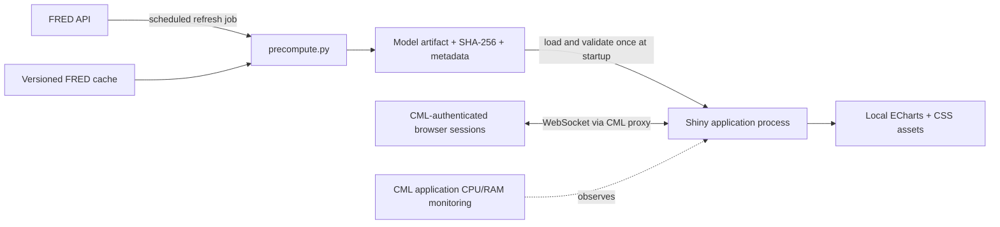

<!-- markdownlint-disable MD013 -->

# Production readiness and CML deployment plan

Last reviewed: 15 July 2026

## Executive decision

The codebase is ready for a controlled production deployment as a Cloudera AI/CML Analytical
Application after the organization completes the model-governance and access-control decisions in
the final section. The runtime is self-contained, read-only, health-checked, resource-bounded, and
does not fetch FRED data or fit the model in a user session.

Recommended initial CML profile: **2 vCPU, 2 GiB RAM, no GPU**, with
`BVAR_MAX_CONCURRENT_SCENARIOS=2`. Use 4 vCPU/4 GiB only if monitoring shows sustained queues or
the expected audience is materially above roughly 20 simultaneous interactive users.

## Production architecture



Separation of responsibilities:

- The refresh job owns network access, FRED credentials, data validation, model fitting, and
  atomic artifact generation.
- The application owns only artifact reads, presentation, and bounded conditional forecasts. It
  never writes project data and does not receive `FRED_API_KEY`.
- CML owns authentication, TLS/proxying, application lifecycle, and CPU/RAM limits. CML
  Analytical Applications are long-running isolated workloads and use a selected resource
  profile. See Cloudera's [Analytical Applications documentation](https://docs.cloudera.com/machine-learning/1.5.1/applications/topics/ml-applications-c.html).

## Findings and disposition

| Severity | Finding in the original code | Resolution |
| --- | --- | --- |
| Blocking | No CML launcher or `CDSW_APP_PORT` contract | Added `cml_entry.py`; binds `127.0.0.1`, validates the port, uses production mode, and caps WebSocket messages. Cloudera documents `CDSW_APP_PORT` and localhost binding in its [ML runtime environment variables](https://docs.cloudera.com/machine-learning/cloud/runtimes/ml-runtimes.pdf). |
| Blocking | MoM/QoQ/YoY bands transformed marginal lower/upper quantiles instead of posterior paths | Artifacts now retain all natural-unit draws; transformed medians and bands are calculated from complete paths, preserving horizon dependence. |
| Blocking | Pickle loaded without transfer-integrity or structural checks | Artifact schema raised to v5; precompute writes an atomic SHA-256 sidecar; startup verifies digest, the configured 22-series panel, mixed-frequency posterior/state shapes, dates, covariance definiteness, diagnostics, fit state, and finite values before serving. |
| Blocking | Scenario scale changes caused reactive cell replacement and could discard unsaved entries | Replaced per-variable reactive strips with one client-side scenario matrix. Scale changes update units, history, placeholders, and labels without replacing inputs. |
| Required | Scenario jobs were not globally bounded and repeat requests recomputed identical results | Added an allocation-aware semaphore and a deterministic 32-result LRU cache. Default concurrency follows `CDSW_CPU_MILLICORES` and is capped at four. |
| Required | The artifact was deserialized once per browser session | It is validated and loaded once at process startup, then shared read-only across sessions. Invalid artifacts fail startup instead of presenting a superficially healthy app. |
| Required | No dedicated health endpoint; root could be healthy while the model was unusable | Added `/healthz` with artifact vintage/schema and cache status. Configure `CDSW_APP_POLLING_ENDPOINT=/healthz`; Cloudera documents this variable in [Application polling endpoint](https://docs.cloudera.com/machine-learning/cloud/site-administration/topics/ml-custom-polling-endpoint.html). |
| Required | Framework errors could expose internals | Enabled Shiny error sanitization, limited user-facing failures to validated input/model messages, and logs unexpected failures server-side. |
| Required | Browser depended on Google Fonts; bundled Highcharts 9.3.1 required a separate commercial-license decision | Removed all browser egress. Replaced it with local Apache ECharts 6.1.0 and retained its Apache-2.0 `LICENSE` and `NOTICE`. |
| Required | Dependency lower bounds did not give CML a reproducible installation | Added upper compatibility bounds, retained `uv.lock`, exported hash-locked `requirements-cml.txt`, and added a staged, versioned `.cml-venv` setup script with atomic activation and rollback. Cloudera recommends installing pinned packages locally to the project in its [ML Runtimes guide](https://docs.cloudera.com/machine-learning/1.5.5/runtimes/ml-pvc-runtimes.pdf). |
| Required | FRED cache writes could leave a partial CSV; malformed caches leaked parser errors | Cache writes are atomic; reads reject malformed/empty data, normalize dates, and collapse duplicate months deterministically. |
| Required | Scenario entry did not scale beyond a handful of series and had weak state feedback | Rebuilt it as one searchable, block-filtered, sticky, keyboard-accessible month matrix with actual/forecast labels, live constraint count, baseline placeholders, responsive layout, and contextual units. |
| Required | Charts omitted scenario uncertainty and lacked an explicit accessible description | Both baseline and scenario path intervals render; charts use responsive SVG and ARIA descriptions. Resize observers dispose cleanly and avoid feedback loops. |
| Required | Historical-state uncertainty semantics were implicit | Published history remains fixed for displayed values and early growth anchors; retained terminal states stay paired with their forecast parameter draws and continue to affect forecast dynamics. The contract is recorded in future release metadata without adding paired historical draws or changing artifact schema. |
| Required | No response hardening | Added `nosniff`, same-origin referrer policy, and a restrictive permissions policy without breaking CML iframe/proxy behavior. |
| Suggestion | FRED/API cache error text referred to entering a key in a UI that had no such control | Corrected the operational message. |

## Measured performance and capacity

The earlier five-variable timing measurements are not representative of the 22-variable model and
have intentionally been removed. Benchmark artifact load, first and cached scenarios, peak RSS,
and two-worker throughput on the target CML runtime before treating the sizing below as final.

Sizing policy:

- **Minimum / light use:** 1 vCPU, 1 GiB, concurrency 1. Suitable for a small pilot; simultaneous
  scenario requests queue.
- **Recommended:** 2 vCPU, 2 GiB, concurrency 2. Leaves a large memory safety margin and keeps the
  event loop responsive while two NumPy/SciPy tasks run.
- **Higher concurrency:** 4 vCPU, 4 GiB, concurrency 4. Use only after CML monitoring shows demand;
  the workload does not benefit from a GPU.
- Keep `OMP_NUM_THREADS`, `OPENBLAS_NUM_THREADS`, `MKL_NUM_THREADS`, and
  `NUMEXPR_NUM_THREADS` at 1 initially; raise them only after measuring the larger matrices under
  concurrent scenario load, because nested BLAS threads can add contention.
- Do not configure more scenario slots than vCPU. A single CML Analytical Application is a
  stateful WebSocket process, not a horizontally autoscaled stateless service.

Cloudera exposes application CPU and memory time series in its
[Monitoring applications UI](https://docs.cloudera.com/machine-learning/cloud/applications/topics/ml-monitoring-applications.html).
Review the first business week at peak usage. Scale up if CPU is above 80% for sustained periods or
scenario wait time exceeds two seconds; investigate before increasing memory if RSS exceeds 70%.

## Deployment procedure

1. Create or update the CML project from this repository. Use a current PBJ Workbench Python 3.11
   or 3.12 CPU Runtime. Python 3.13 is supported by this project if available, but 3.11/3.12 are the
   conservative CML choices.
2. In a CML Session or dependency-setup Job using the same Python minor version as the app, run:

   ```bash
   python scripts/setup_cml.py
   ```

   This builds a new environment under `.cml-venvs/.staging-*`, installs every transitive dependency
   from hash-locked `requirements-cml.txt`, adds the local `src/` package path, and performs import
   checks before activation. It then atomically replaces the `.cml-venv` launcher symlink with a
   pointer to the validated `.cml-venvs/env-*` release. No root privileges are needed.

   The active environment is never cleared in place. If installation or validation fails, the
   staging directory is removed and the existing `.cml-venv` remains active. A legacy real
   `.cml-venv` directory is moved into the versioned store (not deleted) during the first upgrade;
   a failed activation restores it.
3. Confirm the selected release files exist and validate as one set:

   ```bash
   .cml-venv/bin/python -c "from pathlib import Path; from us_bvar.artifact import load_published_release; print(load_published_release(Path.cwd()).release_id)"
   ```

   If `artifacts/active.json` is absent, this intentionally validates the checked-in legacy
   artifact during migration.

4. Create a CML Analytical Application with:

   - Script: `cml_entry.py`
   - Resource profile: 2 vCPU / 2 GiB RAM / 0 GPU
   - Environment: `CDSW_APP_POLLING_ENDPOINT=/healthz`
   - Environment: `BVAR_MAX_CONCURRENT_SCENARIOS=2`
   - Environment: `BVAR_LOG_LEVEL=info`

   CML allows only the application/read-only ports described in
   [Analytical Application limitations](https://docs.cloudera.com/machine-learning/cloud/applications/topics/ml-applications-limitations.html); do not start a second web server in this workload.
5. Keep unauthenticated application access disabled unless the business owner and security team
   explicitly approve it. Give project Viewers access only after confirming the project's broader
   files and CML role policy are appropriate.
6. Smoke-test through the final CML URL, not only in a Session:

   - `/healthz` returns HTTP 200, `status=ok`, schema 5, and the expected `panel_end`;
   - the default six charts render and transformations change without browser console errors;
   - open the scenario matrix, switch CPI to QoQ, enter one value, and run;
   - the scenario chip, orange path/band, and table scenario columns appear;
   - clear returns to baseline; repeat on a narrow browser viewport;
   - verify a second CML user can connect and keep a WebSocket session.
7. Record the project commit, artifact SHA-256 from `metadata.json`, CML Runtime identifier,
   resource-profile ID, owner, and rollback commit in the release ticket.

## Refresh, monitoring, and rollback

Model refresh should be a separately authorized CML Job, never a request-time action:

```bash
FRED_API_KEY=... .cml-venv/bin/python scripts/precompute.py
```

The job stages the panel, model artifact, digest, and metadata in a versioned release directory,
validates all digests and the artifact loader, then atomically replaces the small `active.json` pointer.
Review the new sample end, observation count, checksums, forecast, and `history_semantics` metadata
before restarting the application. Published history is fixed: early growth anchors use the displayed
history, while paired terminal-state uncertainty still affects forecast dynamics. The running process
intentionally keeps its already validated release until restart, so users never see a half-updated model.
If staging or validation fails, the previous pointer is untouched. The
same staged/atomic pattern applies to the CML Python environment; retain the prior `.cml-venvs/env-*`
release until the new application has passed its smoke test, then remove only retired environments.

Operational checks:

- Poll `/healthz`; alert on non-200 or a stale `panel_end` according to the agreed release calendar.
- Monitor CPU, RSS, application restarts, server exceptions, and user-reported scenario latency.
- Refresh after material source releases. The ragged panel preserves source-specific endpoints, and
  the Kalman filter nowcasts missing monthly values and latent monthly GDP at the release edge. Do not
  interpret fixed early anchors as paired historical uncertainty; inspect the release `history_semantics`
  fields when documenting a vintage.
- Roll back by restoring the prior `active.json` pointer (the old release directory is retained)
  and restarting the CML Application. During migration, remove/omit the pointer to use the checked-in
  legacy artifact. Never mix an artifact with a different schema/code revision.

### Structured usage telemetry

The application emits one compact JSON object per event to stdout. This keeps telemetry compatible
with CML application logs and external log forwarders without adding a database, network client, or
project-volume writes. Cloud workbench logs can be accessed according to Cloudera's
[workbench logging documentation](https://docs.cloudera.com/machine-learning/cloud/troubleshooting-pc-admin/topics/ml-logs.html);
on-premises application startup/run logs are described in
[Troubleshooting applications](https://docs.cloudera.com/machine-learning/1.5.5/troubleshooting-pvc-user/topics/ml-user-troubleshooting-applications.html).

Event catalog:

| Event | Meaning | Useful fields |
| --- | --- | --- |
| `application_started` | A dashboard process loaded and validated its artifact | artifact schema, panel end, draw count, cache size, concurrency |
| `session_started` | A browser established a Shiny session | random session correlation token |
| `session_ended` | A browser session disconnected | correlation token, session duration |
| `scenario_run_clicked` | The Run scenario action reached the server | correlation token |
| `scenario_requested` | Inputs passed validation and calculation was submitted | constraint count, constrained variable IDs |
| `scenario_rejected` | The click failed input validation | non-sensitive reason category |
| `scenario_completed` | Conditional calculation completed | constraint count, variable IDs, end-to-end duration |
| `scenario_failed` | Conditional calculation raised an error | duration and exception class, not exception text |

Example:

```json
{"constraint_count":2,"duration_ms":612,"event":"scenario_completed","level":"INFO","process_id":1234,"runtime_id":"abc","service":"us-bvar-dashboard","session_id":"8b7d2e0c5a1f3c90","timestamp":"2026-07-11T09:15:22.104Z","variables":["CPIAUCSL","FEDFUNDS"]}
```

The random session token exists only to correlate lifecycle and scenario events; it is not derived
from a username, cookie, IP address, or CML identity. Scenario values, selected months, table data,
FRED credentials, and exception messages are intentionally excluded. Set
`BVAR_TELEMETRY_ENABLED=false` in the Application environment to disable usage telemetry while
retaining operational error logs.

Minimum useful queries in the chosen log platform:

- launches: count `event=application_started`;
- browser sessions: count `event=session_started`;
- requested usage: count `event=scenario_run_clicked` and `event=scenario_requested`;
- validation rate: `scenario_rejected / scenario_run_clicked`;
- reliability: `scenario_failed / scenario_requested`;
- latency: p50/p95 of `duration_ms` where `event=scenario_completed`.

## Verification completed

- `uv sync --frozen`
- `uv run ruff check .`
- `uv run ruff format --check .`
- `uv run pytest` — 56 tests passed
- Two-chain mixed-frequency artifact rebuild, MCMC release diagnostics, and checksum
  verification
- HTTP checks for `/` and `/healthz`, including security headers
- Real Chrome flow: searchable variable workspace, six default SVG charts, mixed-frequency labels, scenario modal, GDP QoQ entry,
  conditional result, clear-to-baseline, and 390×844 responsive screenshot; no page errors or
  actionable network failures
- Structured telemetry inspection for application, session, click, request, completion, and
  disconnect events with no scenario values or user identifiers
- Cold/cached/concurrent timing and RSS measurements reported above

## Remaining production decisions and accepted risks

These are not code defects that can be silently resolved by an implementation pass:

1. **Model governance is still required.** The repository has deterministic numerical tests, but no
   approved out-of-sample backtest thresholds, challenger model, forecast-drift policy, or named
   model owner. Before business decisions depend on it, validate forecast error and interval
   coverage by vintage and variable, document acceptance limits, and obtain model-risk approval.
2. **FRED data are revised.** The cache and panel hashes make a build reproducible after capture,
   but the pipeline does not query ALFRED real-time vintages. Historical backtests using the current
   panel can therefore contain revision look-ahead. Use ALFRED/vintage storage if real-time forecast
   evaluation is a governance requirement.
3. **Scenarios are exact statistical conditions, not causal interventions.** The UI states this,
   but training and downstream documentation must preserve that distinction. Exact equality paths
   also understate measurement/assumption tolerance compared with soft constraints.
4. **Pickle is trusted-code input.** SHA-256 detects corruption, not a malicious actor who can change
   both artifact and digest. Only the controlled refresh job/release process may publish artifacts;
   project write access is therefore part of the trust boundary.
5. **Single-instance availability.** Standard CML Analytical Applications are long-running isolated
   workloads, but this design has no application-level replica or cross-instance session/cache
   sharing. Recovery is CML restart plus the checked-in artifact. If an explicit HA/SLA requirement
   exists, redesign around a stateless forecast API and separately hosted frontend rather than
   cloning this stateful Shiny process.
6. **Security ownership remains external.** CML administrators must decide authenticated versus
   unauthenticated access, roles, audit retention, network policy, vulnerability scanning, and TLS.
   The app itself intentionally has no independent login system.

Go live only when items 1 and 6 have named owners and written acceptance. Items 2–5 must be accepted
or scheduled based on the dashboard's decision impact and availability target.
