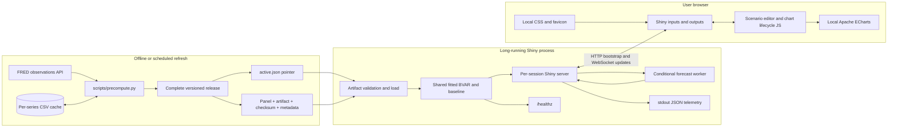
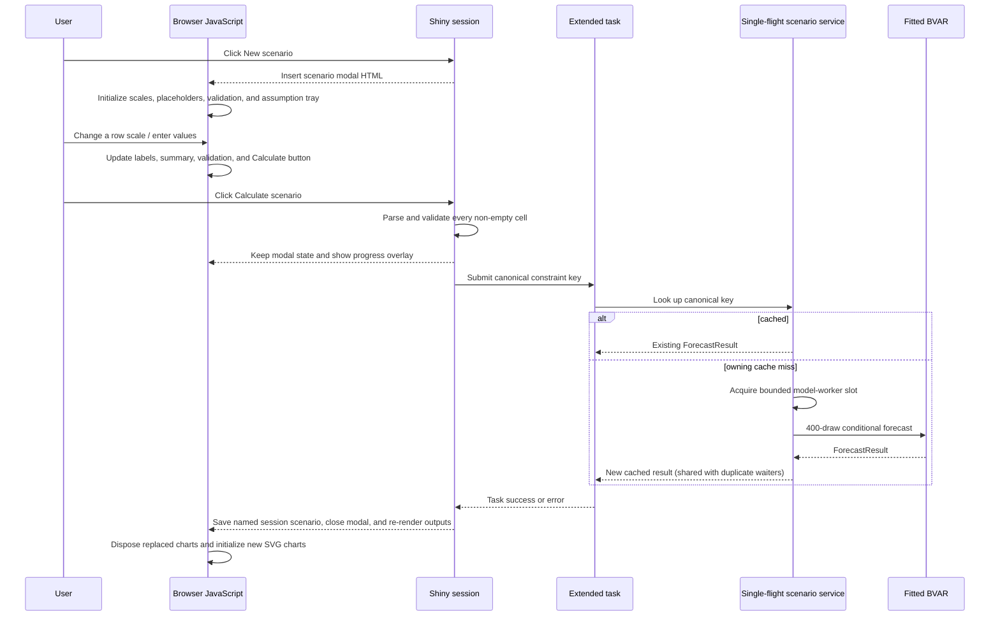

<!-- markdownlint-disable MD013 -->

# US Bayesian VAR scenario dashboard

A Shiny for Python application for exploring a medium-scale mixed-frequency US macroeconomic Bayesian
vector autoregression (BVAR). Quarterly real GDP is represented by a latent monthly state inferred
jointly with monthly indicators. The dashboard displays a precomputed 12-month baseline and lets a user impose
exact assumptions on one or more future values. The model then recomputes the joint conditional
distribution of every variable and month—not merely the cells the user edited.

This document is the developer onboarding guide. It explains the repository, statistical pipeline,
runtime boundaries, UI behavior, browser/server connection, production deployment, and the places
to change when extending the application.

> [!IMPORTANT]
> Scenarios are conditional projections from a reduced-form model. They are not
> identified causal interventions, policy recommendations, or Federal Reserve forecasts.

## Contents

- [What the application does](#what-the-application-does)
- [Architecture](#architecture)
- [Repository map](#repository-map)
- [Data and model lifecycle](#data-and-model-lifecycle)
- [Model specification](#model-specification)
- [How conditional scenarios work](#how-conditional-scenarios-work)
- [How the UI works](#how-the-ui-works)
- [Shiny reactivity and browser integration](#shiny-reactivity-and-browser-integration)
- [Presentation and transformation rules](#presentation-and-transformation-rules)
- [Artifact format and integrity boundary](#artifact-format-and-integrity-boundary)
- [Runtime state, concurrency, and caching](#runtime-state-concurrency-and-caching)
- [Connections and security boundaries](#connections-and-security-boundaries)
- [Telemetry and health checks](#telemetry-and-health-checks)
- [Local development](#local-development)
- [Testing](#testing)
- [CML deployment](#cml-deployment)
- [Common changes](#common-changes)
- [Troubleshooting](#troubleshooting)
- [Code reference index](#code-reference-index)
- [Glossary](#glossary)

## What the application does

The dashboard models 22 latent monthly US variables from mixed-frequency releases:

| Block | FRED IDs | Coverage |
| --- | --- | --- |
| Activity | `GDPC1`, `PCEC96`, `INDPRO`, `RRSFS`, `CMRMTSPL`, `HOUST`, `PERMIT`, `DGORDER` | Output, spending, production, sales, housing, and orders |
| Labor | `UNRATE`, `PAYEMS`, `CIVPART`, `AWHAETP`, `CES0500000003` | Employment, participation, hours, and earnings |
| Prices | `CPIAUCSL`, `CPILFESL`, `PCEPI`, `PCEPILFE`, `PPIFIS` | Headline, core, consumer, and producer prices |
| Financial | `FEDFUNDS`, `GS10`, `BAA10Y`, `M2SL` | Policy, long rates, credit spreads, and money |

All quantity, price-index, earnings, and money series are logged and standardized. Rates, spreads,
participation, and hours are standardized in levels. `GDPC1` is quarterly; the other 21 releases
are monthly.

At build/refresh time, `scripts/precompute.py` downloads or reads cached FRED observations, retains
the ragged monthly calendar, maps quarterly GDP to quarter-end months, estimates the latent-state
BVAR with Gibbs sampling and Kalman simulation smoothing, simulates a baseline, and stages a complete
versioned release. It validates the panel, artifact, checksum, and metadata before atomically
replacing `artifacts/active.json`. At application startup, `app.py` validates and loads the release
selected by that pointer once. It does not fetch data or refit the model during a browser session.

Users can:

1. Choose a readable working set of up to eight variables from the full 22-series model.
2. Inspect six historical/estimated months and twelve forecast months in responsive charts.
3. Switch each chart independently between level, MoM, QoQ, YoY, and annualized variants.
4. Search or filter a scenario matrix covering all 22 variables and twelve forecast months.
5. Enter any sparse set of future assumptions, in a separately chosen scale for each row.
6. Compare baseline and conditional medians plus the configured pointwise percentile intervals.
7. Clear the conditional result and return to the immutable baseline.

The active release selected by `artifacts/active.json` has a `metadata.json` file that is the
authoritative human-readable statement of the data vintage, checksums, calendar length,
source-specific observation counts, forecast dates, draw count, and model configuration. A missing or invalid `artifacts/active.json` fails startup rather than silently selecting an
incomplete or mixed release.

## Architecture

The system deliberately separates networked, credentialed model refresh from the read-only web
application.



There is no application database. Model and baseline state live in the loaded artifact; applied
scenario state lives in each Shiny session; repeated conditional results live in a bounded
process-local memory cache; usage events go to stdout.

### Runtime request flow



## Repository map

```text
.
├── app.py                         Stable Shiny production entrypoint
├── cml_entry.py                   Production CML launcher
├── CML_DEPLOYMENT.md              Detailed production readiness and operations guide
├── pyproject.toml                 Package metadata and uv/dev dependency constraints
├── requirements-cml.txt           Hash-locked production dependency set
├── scripts/
│   ├── precompute.py              Data refresh, fit, baseline, artifact, metadata
│   └── setup_cml.py               Stage and atomically activate a versioned CML environment
├── src/us_bvar/
│   ├── config.py                  Series metadata and pandemic-control months
│   ├── data.py                    FRED client, cache handling, ragged-panel construction
│   ├── state_space.py             Companion state, Kalman filter, simulation smoother
│   ├── transforms.py              Model encoding and display/scenario transformations
│   ├── model.py                   Mixed-frequency BVAR Gibbs estimation and simulation
│   ├── artifact.py                Artifact schema, atomic save, checksum, validation
│   ├── presentation.py            Chart options, quantiles, units, and Great Tables output
│   ├── dashboard.py               Injectable runtime, UI/server composition, health/security
│   ├── scenario_service.py        Bounded single-flight scenario execution and LRU cache
│   └── telemetry.py               Privacy-conscious JSON event logging
├── data/
│   ├── fred_panel.csv             Last generated ragged observation matrix
│   └── cache/                     Ignored per-series download cache, if present
├── artifacts/
│   ├── active.json                Required atomic pointer to the validated release
│   ├── releases/<release-id>/     Immutable panel, artifact, checksum, and metadata bundle
│   └── metadata.json              Reviewable copy of the active release metadata
├── www/
│   ├── app.css                    Entire visual system and responsive layout
│   ├── app.js                     Local chart/scenario browser bootstrap module
│   ├── favicon.svg
│   └── vendor/echarts/            Locally served ECharts bundle, LICENSE, and NOTICE
└── tests/                          Deterministic unit, generated-output, and HTTP tests
```

Generated virtual environments (`.venv/`, `.cml-venv/`, `.cml-venvs/`), `.env`, FRED cache CSVs,
Python caches, and tool caches are ignored. The ragged audit panel and deployable artifact are intentionally present
in the repository so the dashboard can start without FRED access.

## Data and model lifecycle

### 1. Fetch and cache FRED data

`FREDClient` in `src/us_bvar/data.py` owns all FRED communication.

- The endpoint is the FRED `series/observations` JSON API.
- The default requested start is January 1985.
- Each series is requested independently and successful responses are atomically cached as
  `data/cache/<SERIES_ID>.csv`.
- Monthly dates are normalized to month starts. Quarterly FRED dates are mapped from the first month
  of the quarter to the quarter-ending month. Non-numeric values such as `.` become missing.
- FRED publishes `BAA10Y` daily. It is explicitly requested as a monthly average, and the still-
  forming current month is excluded so one partial credit-spread observation cannot advance the
  whole model calendar.
- With no API key, a valid cache is required.
- With an API key, an HTTP/parsing failure falls back to the corresponding valid cache.
- Cache reads reject unreadable files, missing columns, empty results, and invalid dates. Duplicate
  months collapse deterministically to the last value. Aggregated-source cache rows also record
  frequency, aggregation method, and complete-period policy; legacy `BAA10Y` caches without that
  contract are rejected rather than silently reusing end-of-month daily values.

`fetch_panel()` takes an outer join, creates a contiguous monthly calendar, and preserves missing
releases. The sample begins when every monthly series has started and ends at the newest available
monthly observation. GDP is present only in March, June, September, and December when that quarter
has been released; differing monthly release endpoints remain missing. The panel requires at least
120 calendar months and rejects observed non-positive values in log-encoded series.

The checked-in `data/fred_panel.csv` is therefore an audit copy of the ragged observation matrix,
not an interpolated GDP series. `PanelData.last_observations` records the endpoint of each source.
The checked-in active schema-v6 release passed the strict convergence gate using corrected
monthly-average credit-spread input through June 2026.

### 2. Encode natural levels

`LevelTransformer.fit()` in `src/us_bvar/transforms.py` learns one sample mean and standard
deviation per variable.

- Quantity, price-index, earnings, and money series are logged where observed, then standardized.
- Rates, spreads, labor-force participation, and weekly hours are standardized without logging.
- Forecasts are simulated in this model space and decoded back to natural units before being stored
  in `ForecastResult`.

Do not confuse this fixed model encoding with chart transformations. The BVAR is always fitted to
standardized log levels/levels. MoM, QoQ, YoY, and annualized views are presentation and constraint
scales applied around that model.

### 3. Fit and simulate the baseline

`scripts/precompute.py` constructs `BVAR`, runs four independent 1,200-iteration Gibbs chains by
default (600 burn-in, retain every third post-burn-in draw), and asks for 400
posterior-predictive paths with seed `202503`. Every Gibbs iteration samples a latent monthly path
with the Kalman simulation smoother, then samples transition coefficients and innovation covariance
conditional on that path.

The script stages four files under `artifacts/releases/<release-id>/`:

- `fred_panel.csv`, the exact ragged mixed-frequency observation matrix;
- `bvar_forecast.npz`, the fitted model arrays, JSON metadata, and baseline result;
- `bvar_forecast.npz.sha256`, the artifact digest sidecar;
- `metadata.json`, including provenance/endpoints, diagnostics, configuration, and panel/artifact
  digests.

The refresh fails unless rank-normalized split R-hat is at most 1.10 and rank-based effective
sample size is at least 20. Future `metadata.json` files also include `history_semantics` with the
fixed-history anchor mode, terminal-state pairing, and an explicit `paired_historical_draws: false`
flag. Scalar log likelihood and companion radius are checked directly;
high-dimensional coefficient, covariance, terminal-state, and latent-path blocks use their 99th
R-hat and 1st ESS percentiles while still recording absolute extrema and their flat indices. The six
pandemic-month coefficients are estimated once from the initialized mixed-frequency path and then
held fixed across Gibbs draws; they are nuisance controls fixed to zero in every forecast. Draws
with companion radius above 1.10 are rejected from the stability-restricted posterior, and the
build fails if rejections exceed 25% of scheduled retention attempts.

It validates every staged digest and calls the same artifact loader used by the app before renaming
the staging directory into its immutable release directory. Only then does it atomically replace the
small `artifacts/active.json` pointer with `os.replace()`. A failed build leaves the prior pointer and
release active; completed older release directories remain available for rollback by restoring an
older pointer. No unversioned artifact fallback is used.

### 4. Load once at application startup

Importing `app.py` immediately calls `load_published_release()`. With `artifacts/active.json`
present, it verifies all four release-file digests and metadata before loading the artifact; without
the pointer it uses the checked-in root artifact for backward-compatible migration. It exposes the
validated release's model, baseline, and natural-unit history as module-level read-only-by-convention
objects. A corrupt pointer/release fails startup before the app serves a superficially healthy page.

The running process never notices files replaced on disk. A refresh becomes active only after the
application process restarts. Rollback is a pointer operation: activate a previously retained release
manifest and restart, without rebuilding MCMC output.

## Model specification

The defaults are defined by `BVARConfig` in `src/us_bvar/model.py`:

| Setting | Default | Meaning |
| --- | ---: | --- |
| Lags | 4 | Four monthly lags for every variable |
| Overall tightness | 0.02 | Minnesota prior standard-deviation scale |
| Lag decay | 1.0 | Prior standard deviations decay harmonically with lag |
| Own first-lag mean | 0.90 | Persistent but stationary center for each equation |
| Innovation prior strength | 50 | Inverse-Wishart shrinkage toward diagonal initialized variances |
| Interval | `BVARConfig.interval` (default `0.16, 0.84`) | Pointwise posterior predictive quantiles shown in the UI |
| Pandemic controls | Mar–Aug 2020 | Six fixed month indicators, zero during forecasts |
| Production Gibbs chains | 4 × 1,200 | 600 burn-in per chain, thinning 3, 800 retained parameter/state draws |
| Quick/test mode | `BVARConfig.quick()` | Explicitly permits 1 × 8 iterations with 4 burn-in; not a production posterior |
| Monthly measurement variance | 1e-6 | Treat monthly releases as nearly exact |
| Quarterly GDP variance | 1e-4 | Allows error around the log-linear aggregation approximation |
| Maximum companion radius | 1.10 | Stability restriction for retained posterior draws |
| Maximum unstable rejection fraction | 0.25 | Abort if more than 25% of scheduled draws are unstable |

`BVARConfig()` uses the production-sized settings above and requires at least two chains with 20
retained draws per chain before fitting or forecasting. The `BVARConfig.quick()` factory is the
explicit escape hatch for deterministic unit tests; it is intentionally undersized and should not
be used for substantive forecasts. The precompute script keeps production mode explicit and also
runs the convergence release gates before writing an artifact.

The latent vector follows a monthly VAR(4). Monthly releases directly measure their corresponding
current state. At an observed quarter end, standardized log `GDPC1` measures one third of each of
the current and previous two latent monthly GDP states. This is a linear geometric-average
approximation to the arithmetic averaging underlying quarterly SAAR GDP; it keeps filtering,
smoothing, and scenario conditioning linear-Gaussian.

For 22 variables, the transition design contains an intercept, 88 lagged values, and six fixed
pandemic-month indicators. Each equation's first own lag has prior mean 0.90; all other coefficient
prior means are
zero. The Gibbs sampler alternates:

1. a time-varying-measurement Kalman filter and forward-filter/backward-sample state draw;
2. one exact conjugate matrix-normal/inverse-Wishart draw for the complete transition system,
   conditional on the latent path and Minnesota-style row shrinkage. The covariance prior preserves
   initialized marginal innovation variances while shrinking weakly identified cross-series
   covariances toward zero; this is especially important for latent monthly GDP around 2020.

Each forecast path selects a retained coefficient/covariance/terminal-state draw, recursively builds
the 12-month Gaussian forecast distribution, samples or conditions the 264-element future vector,
and decodes it to natural units. For a scenario, retained components are first reweighted by the
marginal Gaussian density of the restriction and then sampled from their component-wise conditional
distributions. `ForecastResult.component_effective_sample_size` reports weight concentration.
Parameter, terminal latent-state, and future innovation uncertainty therefore all enter the paths.

The returned `ForecastResult.samples` has shape `(draws, horizon, variables)` and is marked
non-writeable. Median and interval frames are computed across draws for each point. A fixed seed
makes a given baseline or canonical scenario reproducible.

### Historical-state uncertainty contract

Published-history semantics are intentionally fixed. The history displayed in charts, tables, and
the scenario editor is one smoothed posterior summary; early MoM/QoQ/YoY anchors use that displayed
fixed history. The model does **not** construct paired historical state draws. This makes the anchor
contract reproducible and keeps historical values aligned across baseline and scenarios.

This does not remove terminal-state uncertainty from forecasts. Each forecast component keeps its
retained coefficient draw, innovation covariance, and terminal companion state paired by posterior
draw index. That paired terminal state initializes the forecast dynamics and therefore contributes to
forecast paths and scenario uncertainty. Future metadata records these semantics explicitly.

Relevant methodological context:

- [A Large Bayesian VAR of the United States Economy](https://www.newyorkfed.org/research/staff_reports/sr976)
  motivates shrinkage BVARs and conditional counterfactual paths.
- [Forecasting with Bayesian Vector Autoregressions with Time Variation in the Mean](https://www.newyorkfed.org/medialibrary/media/research/staff_reports/sr327.pdf)
  uses a related monthly CPI, industrial production, unemployment, and policy-rate system.
- [Averaging Forecasts from VARs with Uncertain Instabilities](https://www.federalreserve.gov/pubs/feds/2007/200742/index.html)
  documents conventional four-lag Minnesota settings.
- [Pandemic Priors](https://www.federalreserve.gov/econres/ifdp/pandemic-priors.htm) motivates
  controls that prevent exceptional pandemic observations from dominating persistence.

## How conditional scenarios work

### Conditions affect the entire joint path

For each parameter draw, the model has a Gaussian distribution for a flattened future vector
containing every variable at every horizon. User entries become rows of a linear system:

```text
A × future_path = targets
```

A level entry selects one position in the vector. A change/growth entry relates the current position
to a lagged position. The model first draws an unconditional Gaussian path, then projects it onto the
exact conditional distribution using the forecast covariance. As a result:

- every constrained cell is hit by every posterior draw, up to floating-point precision;
- unconstrained values and uncertainty change according to estimated cross-variable and
  cross-horizon relationships;
- a CPI or policy-rate assumption can affect output, consumption, labor, and later months;
- bands at an exactly constrained level collapse at that point, while other points remain uncertain.

This is fundamentally different from overwriting baseline values after forecasting.

For `GDPC1`, a scenario cell constrains the **latent monthly GDP path**, not a future official
quarterly release. QoQ and YoY entries are changes in that latent monthly path. The observed
quarterly release remains the three-month aggregation defined by the state-space measurement row.

### Constraint scale conversion

Every non-empty cell becomes a `ScenarioConstraint(value, transformation)`. The row selector
chooses one transformation for all entered months in that variable's row.

For log-encoded series:

- Level constraints are logged and standardized.
- Growth constraints are converted with `log1p(percent / 100)`.
- Annualized MoM and QoQ constraints divide the latent change by 12 and 4 respectively before
  building the model-space equation.
- Growth must be greater than −100 percent.

For level-encoded rates:

- Level constraints are standardized directly.
- Changes are percentage-point changes, not percent changes.
- Annualized MoM and QoQ changes divide the entered change by 12 and 4.

If a change's reference month is in the forecast horizon, the constraint row contains `+1` for the
current month and `-1` for that forecast lag. This jointly constrains both future values. If its
reference is historical, the observed standardized value moves to the target side of the equation.

Redundant or inconsistent constraints can make the conditioned system singular and produce a
validation error. Values must be finite and cannot exceed one billion in absolute magnitude.

## How the UI works

### Page structure

`build_ui()` in `src/us_bvar/dashboard.py` creates a `ui.page_fluid` with:

1. Local favicon, CSS, ECharts bundle, and bootstrap JavaScript in the document head.
2. A reactive full-page scenario progress output.
3. A masthead showing the application name and artifact vintage/build time.
4. A status bar showing sample/draw/horizon metadata and scenario controls.
5. A searchable chart library and preset-driven analysis canvas capped at eight visible series.
6. An arrangeable, resizable chart matrix with click, keyboard, and drag interactions.
7. A collapsed-on-load Great Tables forecast data disclosure driven by the same working set.
8. A compact method/risk disclosure and footer note.

The order of `SERIES_SPECS` is a contract used throughout the model, artifact, UI, and table. It is
also the variable order inside NumPy arrays.

### Charts

Each chart card has an independent `plot_transform_<SERIES_ID>` Shiny select. Changing it reruns
only that chart's reactive renderer. The server builds an ECharts option object containing:

- the last six transformed historical values (including latent monthly GDP estimates);
- a dashed teal baseline median connected to the last actual point;
- a teal band using the configured pointwise percentile interval;
- when active, an orange scenario median and lighter orange interval;
- time-axis values in UTC milliseconds, units, decimals, legend, tooltip metadata, and ARIA text.

The server returns a small HTML wrapper with JSON in a non-executable
`<script type="application/json">`. Browser JavaScript parses it, adds custom polygon series for the
interval ribbons, supplies locale-aware dates/tooltips, and initializes ECharts with the SVG
renderer.

Chart and scenario row selectors are independent. Selecting “YoY” on a chart does not change the
scenario editor, and selecting “QoQ” in the editor does not change a chart. This is intentional: one
controls display, the other controls the interpretation of assumptions.

The left chart library can be searched by label or FRED ID and filtered by macro group. Users may
click Add or drag a library row into the matrix. Existing cards have a dedicated drag handle; a
compact options menu provides accessible Move earlier/later actions, Standard/Wide/Tall/Focus sizes,
and removal without crowding the chart header. Overview, Inflation & policy, and Growth & labor
presets replace the current working set through the same ordered Shiny input used by
the table. Selection order, card dimensions, and chart transformations are stored under a versioned
browser `localStorage` key. Restored IDs are deduplicated, checked against the current 22-series
library, and capped at eight before they reach Shiny.

### Forecast table

The table always uses natural levels; chart selectors do not affect it. It is presented in a native
collapsed disclosure so it remains available without dominating the canvas. It follows the current
variable workspace selection and contains six actual rows
and twelve forecast rows. Each forecast cell shows the median and its configured pointwise percentile
interval. With a scenario active, each variable spanner gains separate Baseline and Scenario
columns. Historical values are repeated in both columns for alignment.

`forecast_gt()` builds the table server-side with Great Tables and Shiny inserts its raw HTML. CSS
sets a minimum width, so narrow viewports scroll horizontally instead of compressing values into
unreadable columns.

### Scenario editor

“New scenario” inserts a viewport-constrained extra-large modal containing one CSS grid and a sticky
action footer:

- an editable session-local name, prefilled sequentially as Scenario 1, Scenario 2, and so on;
- two sticky left columns for 22 variable labels and their scale selectors/units;
- three sticky-header actual-month columns;
- twelve forecast-month input columns;
- 264 text inputs in total, with client-side name/FRED-ID search and block filtering.

Only forecast cells are editable. Historical/estimated values establish context. Blank forecast
fields mean “do not constrain this point”; their muted, thousands-formatted placeholders are baseline
medians on the currently selected scale and are never submitted as constraints.

The inputs use `inputmode="decimal"`. Client-side validation catches malformed, non-finite,
out-of-range, and transformation-domain values before submission; the server repeats authoritative
validation. The field ARIA label includes the variable, month, and current units. An assumption tray
lists every non-empty value, supports direct focus/removal, and can filter the matrix to entered rows.

Changing a row scale updates its units, historical values, baseline placeholders, and input ARIA
labels without replacing inputs. If the row already contains assumptions, a three-way
dialog lets the user keep and explicitly reinterpret the numbers, clear them, or cancel. Row tools
can hold a first value across later months, linearly interpolate two endpoints, or clear a row;
tab/newline-delimited spreadsheet values can be pasted across months. Two starter paths provide
editable policy-rate and CPI examples.

The Calculate/Update button is enabled only when a name and at least one valid assumption exist.
Reset and exit actions protect entered work with confirmation. Reopening a scenario restores its name,
transformations, and values; Duplicate creates an editable copy. Scenarios can be selected, edited,
exported as JSON, compared against one other named scenario, or deleted with confirmation. They
deliberately last only for the current browser session, which is stated beside the switcher.

### Running a scenario

The server scans all 264 inputs and revalidates every non-empty field. A valid request leaves the
editor in place while an extended task runs under a full-page status overlay.

On success, the named scenario is added to the session collection and made active. That invalidates
the visible charts, table, legend, and scenario switcher; the modal then closes and a completion
notification appears. The immutable baseline remains available in the switcher.

User-correctable errors appear both in the modal's inline alert and as a temporary notification.
Unexpected errors are logged with a traceback while the browser receives only “Scenario calculation
failed.” If a new run fails while an older scenario is active, the older result remains active.

### Responsive and accessible behavior

`www/app.css` defines the dark visual system, spacing, table styles, modal grid, focus states, and
breakpoints.

- Wide screens use a 12-column matrix: standard cards span six columns and expanded cards span all
  twelve. Below 1250 px, cards use the full canvas width.
- Below 900 px, the masthead/status sections stack, the sticky chart library moves above the canvas,
  and its rows use a compact two-column list.
- Below 560 px, the library and charts use one column, padding and chart height reduce, and chart
  controls stack.
- The scenario matrix keeps its 1600 px minimum layout inside a two-axis scroll container rather
  than collapsing cells.
- Chart resize observers follow their containers rather than assuming viewport width.
- `prefers-reduced-motion` reduces transitions and slows the progress spinner.
- Modal, progress, chart, input, and live-count elements carry explicit ARIA roles/labels where
  required.

## Shiny reactivity and browser integration

### Per-session reactive graph

`server()` creates a new `reactive.Value[ForecastResult | None]` for every browser session. The
following outputs depend on it:

| Output | Dependencies | Effect |
| --- | --- | --- |
| `scenario_progress` | extended-task status | Adds/removes blocking progress overlay |
| `scenario_summary` | session scenario state | Shows Baseline or Scenario · N chip |
| `variable_selection_summary` | `visible_variables` | Reports the working-set size |
| `chart_grid` | `visible_variables` | Inserts cards for the selected working set |
| `chart_<SERIES_ID>` | its chart selector + scenario state | Rebuilds one chart configuration |
| `forecast_table` | working set + scenario state | Selects variables and adds/removes scenario columns |

Event effects handle opening the modal, parsing/running a scenario, consuming task results, clearing
state, and resetting modal fields. Chart outputs suspend when absent from the dynamic workspace and
resume when their cards are selected.

### Browser bootstrap script

`www/app.js` is the local browser module responsible for behavior that should not require
a reactive round trip. `browser_bootstrap()` only emits its local script tag:

- discover `.bvar-echart` nodes, including when the inserted node itself is the mutation root;
- parse chart JSON and convert interval metadata into custom ECharts polygon series;
- format dates/numbers using the browser locale;
- initialize charts with the local SVG renderer;
- resize charts with one `ResizeObserver` per chart;
- detect Shiny DOM replacements with a document-level `MutationObserver`;
- disconnect observers and dispose ECharts instances before removed nodes leak resources;
- update scenario row displays and count fields immediately in the browser;
- filter the 22-row scenario matrix by label, FRED ID, or macro block without a server round trip.

A JSON-text signature on each chart wrapper prevents redundant initialization. Server-generated JSON
escapes `</` so data cannot accidentally terminate the containing script element.

## Presentation and transformation rules

`PLOT_TRANSFORMATIONS` in `src/us_bvar/transforms.py` is the single registry for labels, lag lengths,
and annualization factors.

| Key | Label | Lag | Annualization |
| --- | --- | ---: | ---: |
| `level` | Level | 0 | none |
| `mom` | MoM | 1 month | none |
| `qoq` | QoQ | 3 months | none |
| `yoy` | YoY | 12 months | none |
| `mom_annualized` | MoM · annualized | 1 month | 12 |
| `qoq_annualized` | QoQ · annualized | 3 months | 4 |
| `yoy_annualized` | YoY · annualized | 12 months | 1 |

For log-encoded quantities, non-annualized display growth is
`(current / lagged - 1) × 100`; annualized display growth is
`((current / lagged)^factor - 1) × 100`. For rates, the display is `current - lagged` in
percentage points, multiplied by the annualization factor when applicable.

Forecast transformations operate on every complete posterior path *before* quantiles are taken.
This preserves cross-horizon dependence and gives correct nonlinear transformed medians and bands.
Transforming already summarized lower/median/upper values would be incorrect.

Formatting metadata such as labels, level decimals, table units, currency prefix, and percent suffix
lives in `SeriesSpec`, not in the chart/table functions. Transformation views use two decimals in
the scenario editor and tooltips; level views use the series-specific precision.

## Artifact format and integrity boundary

`ForecastArtifact` schema version 6 contains:

- creation time, monthly calendar start/end, and calendar observation count;
- the raw ragged observation matrix and observation mask;
- smoothed complete monthly natural/model histories;
- retained coefficient, innovation-covariance, terminal-state, and latent-path draws;
- fixed published-history semantics (early anchors use displayed history; terminal states remain
  paired with forecast dynamics); these are metadata semantics, not a schema change;
- the baseline `ForecastResult`, including all natural-unit forecast paths.

`load_published_release()` verifies the active manifest's four file digests and metadata before
calling `load_artifact()`. `load_artifact()` then verifies the artifact sidecar before opening the
compressed NumPy archive with `allow_pickle=False`, reconstructs only known model fields, and validates:

- Python object type and supported schema;
- exactly twelve forecast dates;
- fitted model history and matching sample metadata;
- baseline draw count and `(draws, dates, variables)` shape;
- forecast dates beginning one month after panel end;
- matching variable/date axes and interval configuration;
- finite summary values and samples.

The checksum detects accidental corruption and mismatched transfer. It is not by itself a
cryptographic signature from a trusted publisher. The archive contains JSON and numeric arrays,
never Python objects, and is loaded with pickle disabled. Set `BVAR_ARTIFACT_SHA256` from trusted
deployment configuration to pin the expected digest independently of the mutable artifact directory.

An artifact schema or class-layout change normally requires rerunning precompute and deploying code,
array archive, checksum, and metadata together.

## Runtime state, concurrency, and caching

### Process-wide state

The following are created once when the production runtime is initialized and shared by all sessions:

- validated `ARTIFACT`, fitted `MODEL`, `BASELINE`, and `HISTORY`;
- compact cached forecast means, impulse responses, and innovation factors;
- a thread-safe 32-entry scenario service that bounds native computations and coalesces concurrent
  misses for the same canonical key.

The scenario cache key is a sorted immutable tuple of `(forecast step, series ID, numeric value,
transformation)`. Equivalent dictionaries therefore share a result. Scenario simulations use seed
`202507`, so a canonical key is deterministic and safe to cache. The cache is in memory only, is not
shared between processes, and disappears on restart.

### Per-session state

Every browser session owns:

- its dictionary of named scenarios plus active and optional comparison identifiers;
- an extended-task controller and current task status/result;
- a random 16-hex-character telemetry correlation token;
- task timing and non-sensitive constraint-count/variable metadata.

Users do not see or modify one another's scenarios. Named scenarios reset when the browser session
ends, but an active scenario's assumptions can be exported as JSON. Users can still benefit from the
same process cache when assumptions match exactly.

### Execution limits

NumPy/SciPy forecasting is synchronous CPU work, so the extended task uses `asyncio.to_thread()` to
avoid blocking Shiny's event loop. The process-wide scenario service bounds active computations;
identical concurrent requests share one future instead of occupying multiple model workers.

`BVAR_MAX_CONCURRENT_SCENARIOS` sets the limit. If absent, the default derives from
`CDSW_CPU_MILLICORES`: one slot per 1000 millicores, clamped to 1–4. Invalid or non-positive values
fall back or clamp to at least one. Extra requests wait at the semaphore; they are not rejected.

The CML launcher forces BLAS-related thread counts to one, overriding inherited values. Keep
scenario slots at or below allocated vCPU to avoid nested CPU oversubscription.

## Connections and security boundaries

| Connection | When | Direction | Data | Notes |
| --- | --- | --- | --- | --- |
| FRED API | Precompute only | refresh job → FRED | API key, series ID, start date; observations return | Dashboard runtime does not need the key or network |
| FRED cache | Precompute only | local filesystem ↔ refresh job | One CSV per series | Ignored by Git; enables offline/fallback refresh |
| Artifact files | Startup | local filesystem → app | Code-free model/baseline archive plus digest | Loaded and validated once |
| Browser/Shiny | Runtime | bidirectional | UI inputs and reactive HTML over Shiny HTTP/WebSocket transport | CML proxy supplies external TLS/authentication |
| Static assets | Runtime | app → browser | CSS, favicon, local app.js and ECharts JS | No CDN, font, or browser egress dependency |
| Telemetry | Runtime | app → stdout | Event names, timings, counts, variable IDs, random session token | No scenario values or CML identity |
| Health polling | Runtime | CML/monitor → `/healthz` | Artifact vintage/schema and cache occupancy | No-store response |

The application does not write model data during user sessions, does not use cookies beyond
framework/proxy behavior, does not call external services, and does not contain an authentication
implementation. In CML, authentication, TLS termination, proxying, lifecycle, and resource limits
belong to the platform.

`SecurityHeadersMiddleware` adds these headers to HTTP responses:

- `X-Content-Type-Options: nosniff`;
- `Referrer-Policy: same-origin`;
- a `Permissions-Policy` disabling camera, microphone, and geolocation.

It intentionally does not add frame restrictions that would break CML proxy/iframe behavior.
Shiny error sanitization is enabled and application debug mode is disabled.

## Telemetry and health checks

### Structured telemetry

`src/us_bvar/telemetry.py` writes compact, sorted JSON objects to stdout. Telemetry defaults to on;
set `BVAR_TELEMETRY_ENABLED=false` (also accepts `0`, `no`, or `off`) to disable it.

| Event | Emitted when | Non-sensitive fields beyond common metadata |
| --- | --- | --- |
| `application_started` | Artifact loads and process initializes | schema, panel end, draws, cache size, concurrency |
| `session_started` | A Shiny session starts | random session token |
| `session_ended` | Session disconnects | token, duration |
| `scenario_run_clicked` | Run reaches server | token |
| `scenario_requested` | Parsed inputs are accepted | count and sorted variable IDs |
| `scenario_rejected` | Input parsing/validation fails before submission | generic reason category |
| `scenario_completed` | Task succeeds | count, variable IDs, end-to-end duration |
| `scenario_failed` | Task raises | count, IDs, duration, exception class |

Common fields include UTC timestamp, level, service name, event name, process ID, and
`CDSW_ENGINE_ID` (or `local`). Scenario numeric values, selected months, IP addresses, usernames,
CML identities, and exception messages are deliberately absent.

Operational logs use standard Python logging. Set `BVAR_LOG_LEVEL` to a valid logging level;
`TRACE` maps application logging to Python's debug threshold. Invalid values warn and fall back to
INFO. The CML launcher separately validates the level passed to Shiny.

### Health endpoint

`GET /healthz` returns HTTP 200 JSON similar to:

```json
{
  "status": "ok",
  "artifact_schema": 6,
  "release_id": "20260301T120000Z-a1b2c3",
  "variable_count": 22,
  "panel_end": "2026-05-01",
  "forecast_end": "2027-05-01",
  "scenario_cache": {"size": 0, "max_size": 32}
}
```

It sets `Cache-Control: no-store`. Because artifact loading occurs before routes are served, a live
health response also implies that startup artifact checks passed. It does not run a fresh numerical
forecast or contact FRED.

## Local development

### Prerequisites

- Python 3.11, 3.12, or 3.13
- [uv](https://docs.astral.sh/uv/)
- A FRED API key only when downloading fresh data

Install the project and development dependencies:

```bash
uv sync
```

The checked-in artifact is enough to start the UI immediately:

```bash
uv run shiny run --reload app.py
```

Open the URL printed by Shiny. Reload mode restarts the process when source files change, which also
reloads the artifact and clears the in-memory scenario cache.

### Rebuild from FRED

Create the ignored environment file and add a real key:

```bash
cp .env.example .env
uv run python scripts/precompute.py
```

Optional precompute arguments:

```bash
# Use valid per-series cache files and make no network request
uv run python scripts/precompute.py --offline

# Change simulation count and deterministic baseline seed
uv run python scripts/precompute.py --draws 800 --seed 12345

# Change mixed-frequency Gibbs length, burn-in, and thinning
uv run python scripts/precompute.py --mcmc-iterations 2400 --burn-in 1200 --thin 3 --mcmc-chains 4
```

`--offline` deliberately passes an empty API key to `FREDClient`; every required series must already
have a valid cache. The standard script loads `FRED_API_KEY` from repository-root `.env`.

### Useful environment variables

| Variable | Used by | Default | Purpose |
| --- | --- | --- | --- |
| `FRED_API_KEY` | precompute | none | Authenticates fresh FRED requests |
| `BVAR_LOG_LEVEL` | app and launcher | `INFO` | Operational/Shiny log verbosity |
| `BVAR_TELEMETRY_ENABLED` | app | `true` | Enables structured usage events |
| `BVAR_MAX_CONCURRENT_SCENARIOS` | app | derived | Process-wide conditional worker slots |
| `BVAR_ARTIFACT_SHA256` | app | none | Optional trusted digest pin checked before archive load |
| `CDSW_CPU_MILLICORES` | app | `2000` | Derives default scenario concurrency |
| `CDSW_ENGINE_ID` | telemetry | `local` | Runtime identifier included in events |
| `CDSW_APP_PORT` | CML launcher | `PORT`, then `8000` | Local application port |
| `CDSW_APP_POLLING_ENDPOINT` | CML platform | recommended `/healthz` | Selects health polling route |

The application uses a fixed 12-month horizon, runtime scenario draw count (400), scenario seed,
and cache size in `src/us_bvar/dashboard.py`. It loads only the digest-validated release selected by
`artifacts/active.json`; these are not environment options.

## Testing

Run the full quality gate:

```bash
uv run pytest
uv run ruff check .
uv run ruff format --check .
```

GitHub Actions runs this same gate on every push and pull request for Python 3.11, 3.12, and 3.13.
The workflow installs dependencies with `uv sync --frozen`; the checked-in forecast artifact, panel,
and local ECharts assets remain available to app tests without FRED or browser automation.

The test suite is intentionally deterministic and organized by boundary:

- `tests/test_data.py`: cache behavior, daily-to-monthly aggregation contracts, incomplete-period
  exclusion, quarter-end GDP mapping, ragged-edge preservation, and validation.
- `tests/test_model.py`: Kalman measurement aggregation, ragged-edge smoothing, retained companion
  states, reproducibility, exact natural/transformed conditions, forecast covariance, and failures.
- `tests/test_artifact.py`: round trip, digest creation, and corruption rejection before unpickling.
- `tests/test_presentation.py`: history/forecast lengths, transformed posterior summaries, units,
  table formatting, intervals, and scenario contrast.
- `tests/test_app.py` and `tests/test_scenario_service.py`: generated modal accessibility, local
  static-asset HTTP behavior, scenario cache/single-flight behavior, progress output,
  health/security HTTP behavior, and injected telemetry.
- `tests/test_telemetry.py`: event shape, privacy exclusions, and opt-out behavior.

App tests exercise generated UI and HTTP/static-asset behavior rather than implementation source strings.
Renaming CSS classes or input IDs can still require deliberate test updates when behavior changes. `tests/conftest.py` supplies synthetic positive monthly data and uses
`BVARConfig.quick()` so model tests do not use FRED or the production artifact or incur a
production-length fit.

For UI changes, also perform a browser smoke test: load all charts, change scales, open the modal,
enter a constraint, run it, inspect scenario lines/table columns, clear it, and repeat at a narrow
viewport. Unit tests do not execute a real browser layout engine.

## CML deployment

See `CML_DEPLOYMENT.md` for production findings, sizing evidence, deployment validation, monitoring,
refresh, rollback, and outstanding governance decisions.

The short path is:

1. Use a CML Python 3.11–3.13 CPU runtime.
2. In a Session or dependency-setup Job, run `python scripts/setup_cml.py`.
3. Configure the Analytical Application script as `cml_entry.py`.
4. Start with 2 vCPU, 2 GiB RAM, no GPU, and
   `BVAR_MAX_CONCURRENT_SCENARIOS=2`.
5. Set `CDSW_APP_POLLING_ENDPOINT=/healthz`.
6. Keep unauthenticated access disabled unless explicitly approved.

`scripts/setup_cml.py` builds a staged environment under `.cml-venvs/`, installs every dependency from
`requirements-cml.txt` with hash verification, adds `src/` via a `.pth` file, and verifies imports before
atomically switching the `.cml-venv` symlink to the new version. A failed install or validation cleans
up only its staging directory and leaves the prior active environment untouched.

`cml_entry.py` then:

- follows the atomically activated `.cml-venv` environment and validates required artifact/static files;
- validates the selected port;
- adds `src/` to `PYTHONPATH`;
- forces common BLAS thread pools to one to prevent inherited oversubscription;
- replaces itself with `python -m shiny run`;
- binds to `127.0.0.1:$CDSW_APP_PORT`;
- caps WebSocket messages at 4 MiB;
- disables development mode.

Refresh the model in a separately authorized job, review the new panel/metadata/forecast, and then
restart the application. Roll back code and its matching artifact set together.

## Common changes

### Add or replace a modeled series

This is a schema/model change, not just a UI edit.

1. Update `SERIES_SPECS` in `src/us_bvar/config.py`, preserving the intended array order.
2. Decide whether its natural level is logged or left linear and define its formatting metadata.
3. Declare monthly/quarterly frequency and ensure the state-space observation row is correct.
4. Recompute the artifact and metadata.
5. Update model, presentation, modal, and artifact tests for the new variable count/order.
6. Review chart-grid layout and the scenario matrix width.

Additional quarterly series require an explicit measurement row in
`src/us_bvar/state_space.py::observation_system()`. Do not forward-fill or interpolate source
observations before estimation; missingness is part of the Kalman likelihood.

### Add a display or scenario transformation

1. Add its literal, label, lag, and factor in `src/us_bvar/transforms.py`.
2. Implement/verify both natural-path display math and inverse constraint math.
3. Confirm `plot_units()` describes log-growth versus rate-change semantics correctly.
4. Add tests for historical display, full forecast draws, constraints referencing history, and
   constraints referencing another forecast month.
5. Check modal placeholder JSON and chart selector rendering.

### Change charts or table presentation

- Server-side data/quantiles/options: `src/us_bvar/presentation.py`.
- Card/table composition and reactivity: `src/us_bvar/dashboard.py`.
- ECharts instance, ribbons, locale tooltip, resize/disposal: `www/app.js`.
- Layout, colors, breakpoints, modal grid: `www/app.css`.

Keep the browser bundle local and retain third-party license/notice files. When adding HTML-bearing
data, maintain the existing escaping and sanitized-error boundaries.

### Change model settings

Edit `BVARConfig`, rerun model tests, rebuild the artifact, and verify metadata. If forecast horizon
or variable order changes, also update the hard runtime expectations and artifact schema/validation
as necessary. The dashboard currently requires exactly twelve baseline months.

### Change telemetry

Add the event at the call site in `src/us_bvar/dashboard.py` and test both its usefulness and privacy properties. Do
not add scenario values, entered months, identities, raw errors, IP addresses, or credentials.

## Troubleshooting

### Startup says the precomputed forecast is missing

Run `uv run python scripts/precompute.py`, or restore one complete release directory and its
`artifacts/active.json` pointer. The expected paths are fixed relative to `app.py`.

### Startup reports a checksum or schema failure

The active release files may come from different refreshes, the artifact may be corrupt, or code may
expect another schema. Run `uv run python scripts/precompute.py` to stage and validate a complete release,
then atomically update `artifacts/active.json`. If restoring manually, deploy the matching panel, archive,
checksum, metadata, and active manifest from one release directory. Do not bypass the check.

### Precompute asks for a FRED key

Set `FRED_API_KEY` in `.env`, or use `--offline` only after all 22 valid per-series cache CSVs exist.
The checked-in `data/fred_panel.csv` is an output/audit file; it is not the input used by offline
precompute.

### Series have different endpoints

Expected: the panel calendar ends at the newest monthly release, while each column preserves its
own endpoint. Inspect `metadata.json::last_observations`; the Kalman filter handles missing releases
at the ragged edge. Quarterly GDP normally trails the latest monthly indicators.

### A scenario value is rejected

Check numeric syntax and units. Commas are allowed, but text, infinities, and NaN are not. Levels for
log-modeled series must be positive, log-series growth must exceed −100%, and extreme values over
one billion in magnitude are rejected. Multiple relational growth assumptions may also be redundant
or inconsistent.

### A scenario is slow

The first unique condition evaluates all posterior components before drawing 400 paths. Identical
conditions should hit the process-local cache, and simultaneous identical misses share one
calculation. Check `/healthz` cache occupancy/in-flight count, completion telemetry, allocated vCPU,
`BVAR_MAX_CONCURRENT_SCENARIOS`, and BLAS thread settings.

### Charts are blank but the page loads

Check the browser console and network panel for the local `vendor/echarts/echarts.min.js` asset.
Confirm the chart output contains `.chart-config` JSON. DOM replacement must pass through the
MutationObserver; chart removal must dispose the old instance and resize observer.

### Scale changes appear not to affect another component

Chart scale selectors, scenario row selectors, and the natural-level results table are intentionally
independent. Verify which control owns the component before treating this as a reactive defect.

## Code reference index

References use repository-relative paths and stable symbols rather than line numbers.

| Concern | File | Key symbols |
| --- | --- | --- |
| Application factory/runtime | `src/us_bvar/dashboard.py` | `DashboardRuntime`, `create_runtime()`, `create_app()` |
| UI composition | `src/us_bvar/dashboard.py` | `build_ui()`, `chart_cards()`, `scenario_modal()`, `_scenario_row()` |
| Browser integration | `www/app.js` | chart lifecycle and scenario editor bootstrap |
| Session reactivity | `src/us_bvar/dashboard.py` | `server()`, `_scenario_task()`, `_run_scenario()`, `_handle_scenario_result()` |
| Scenario memoization | `src/us_bvar/scenario_service.py` | `ScenarioForecastService` |
| Health/security | `src/us_bvar/dashboard.py` | `_health()`, `SecurityHeadersMiddleware`, `DashboardRuntime.app` |
| Series registry | `src/us_bvar/config.py` | `SeriesSpec`, `SERIES_SPECS`, `SERIES_BY_ID` |
| Pandemic controls | `src/us_bvar/config.py` | `PANDEMIC_CONTROL_MONTHS` |
| FRED/caching | `src/us_bvar/data.py` | `FREDClient`, `fetch_series()`, `fetch_panel()`, `PanelData` |
| Kalman state space | `src/us_bvar/state_space.py` | `kalman_filter()`, `simulation_smoother()`, `observation_system()` |
| Model encoding | `src/us_bvar/transforms.py` | `LevelTransformer` |
| Display transformations | `src/us_bvar/transforms.py` | `PLOT_TRANSFORMATIONS`, `transform_path()`, `transform_forecast_samples()` |
| Scenario values | `src/us_bvar/transforms.py` | `ScenarioConstraint`, `transformation_spec()` |
| BVAR fitting | `src/us_bvar/model.py` | `BVARConfig`, `BVAR.fit()`, `_design_matrix()`, `_minnesota_prior_mean()` |
| Forecast mechanics | `src/us_bvar/model.py` | `BVAR.forecast()`, `_forecast_components()`, `_apply_component_loading()` |
| Conditional system | `src/us_bvar/model.py` | `_constraint_system()`, `_project_component_loading()`, `_condition_component_samples()` |
| Result contract | `src/us_bvar/model.py` | `ForecastResult` |
| Artifact lifecycle | `src/us_bvar/artifact.py` | `ForecastArtifact`, `save_artifact()`, `load_artifact()`, `load_published_release()`, `activate_release()`, `_validate_artifact()` |
| Chart/table output | `src/us_bvar/presentation.py` | `echarts_options()`, `forecast_gt()`, `forecast_summary_on_scale()` |
| Units/formatting | `src/us_bvar/presentation.py` | `plot_units()`, `_forecast_table_frame()` |
| Telemetry | `src/us_bvar/telemetry.py` | `telemetry_enabled()`, `event()` |
| Refresh orchestration | `scripts/precompute.py` | `parse_args()`, `main()`, `history_semantics_metadata()` |
| CML environment | `scripts/setup_cml.py` | `main()` |
| CML process launch | `cml_entry.py` | `_application_port()`, `main()` |
| Visual system | `www/app.css` | CSS variables, chart grid, scenario matrix, responsive media queries |

## Glossary

| Term | Meaning in this repository |
| --- | --- |
| History | Fixed displayed smoothed monthly state history; GDP is estimated between quarterly releases |
| Historical-state uncertainty | Not drawn for early growth anchors; terminal-state uncertainty remains paired with forecast dynamics |
| Artifact | Versioned code-free NumPy archive containing model arrays and the baseline forecast |
| Ragged panel | Monthly calendar retaining source-specific missing observations and endpoints |
| Latent monthly GDP | Monthly GDP state inferred jointly from quarterly GDP and monthly indicators |
| Baseline | Unconditional posterior predictive forecast generated at precompute time |
| Condition/constraint | An exact user-specified future level or change relationship |
| Draw/path | One simulated set of all variables across the full forecast horizon |
| Forecast step | Zero-based month offset into the twelve-month future path |
| Model space | Logged where configured, then standardized variable representation |
| Natural units | Original index, dollar, or percentage level shown in the table |
| Pointwise interval | Quantiles computed separately for each variable and month, not a joint band |
| Scenario | Conditional posterior predictive forecast given user constraints |
| Transformation | Level/MoM/QoQ/YoY display and scenario-entry scale |
| Vintage | Data cutoff and artifact creation time associated with a model release |
