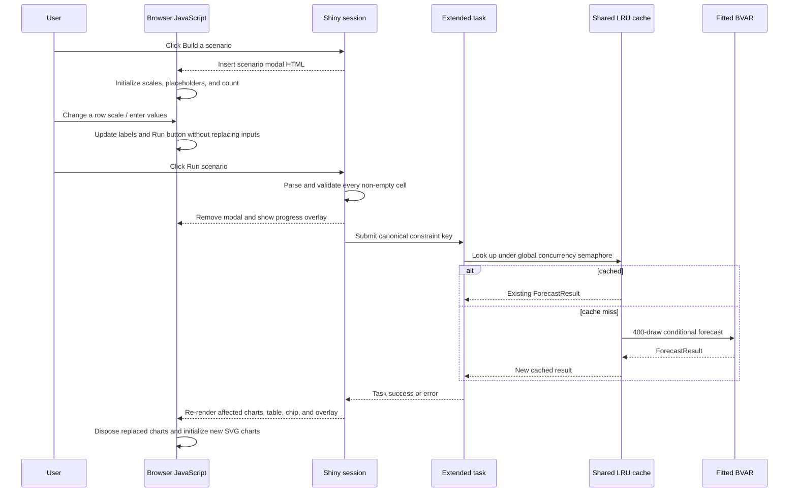

# US Bayesian VAR scenario dashboard

A Shiny for Python application for exploring a compact monthly US macroeconomic Bayesian vector
autoregression (BVAR). It displays a precomputed 12-month baseline forecast and lets a user impose
exact assumptions on one or more future values. The model then recomputes the joint conditional
distribution of every variable and month—not merely the cells the user edited.

This document is the developer onboarding guide. It explains the repository, statistical pipeline,
runtime boundaries, UI behavior, browser/server connection, production deployment, and the places
to change when extending the application.

> [!IMPORTANT]
> Scenarios are conditional projections from a deliberately small reduced-form model. They are not
> identified causal interventions, policy recommendations, or Federal Reserve forecasts.

## Contents

- [What the application does](#what-the-application-does)
- [Architecture](#architecture)
- [Repository map](#repository-map)
- [Data and model lifecycle](#data-and-model-lifecycle)
- [Model specification](#model-specification)
- [How conditional scenarios work](#how-conditional-scenarios-work)
- [How the UI works](#how-the-ui-works)
- [Shiny reactivity and browser integration](#shiny-reactivity-and-browser-integration)
- [Presentation and transformation rules](#presentation-and-transformation-rules)
- [Artifact format and integrity boundary](#artifact-format-and-integrity-boundary)
- [Runtime state, concurrency, and caching](#runtime-state-concurrency-and-caching)
- [Connections and security boundaries](#connections-and-security-boundaries)
- [Telemetry and health checks](#telemetry-and-health-checks)
- [Local development](#local-development)
- [Testing](#testing)
- [CML deployment](#cml-deployment)
- [Common changes](#common-changes)
- [Troubleshooting](#troubleshooting)
- [Code reference index](#code-reference-index)
- [Glossary](#glossary)

## What the application does

The dashboard models five monthly US series:

| FRED ID | UI label | Model encoding | Level units |
|---|---|---|---|
| `INDPRO` | Industrial production | log, then standardized | Index, 2017=100 |
| `PCEC96` | Real personal consumption expenditures | log, then standardized | Billions of chained 2017 dollars, SAAR |
| `CPIAUCSL` | Consumer Price Index | log, then standardized | Index, 1982–84=100 |
| `UNRATE` | Unemployment rate | standardized level | Percent |
| `FEDFUNDS` | Effective federal funds rate | standardized level | Percent |

At build/refresh time, `scripts/precompute.py` downloads or reads cached FRED observations, keeps
only months observed for every series, estimates the BVAR, simulates a baseline, and writes a
versioned artifact. At application startup, `app.py` validates and loads that artifact once. It does
not fetch data or refit the model during a browser session.

Users can:

1. Inspect six actual months and twelve forecast months in five charts.
2. Switch each chart independently between level, MoM, QoQ, YoY, and annualized variants.
3. Open a single scenario matrix covering all five variables and twelve forecast months.
4. Enter any sparse set of future assumptions, in a separately chosen scale for each row.
5. Compare baseline and conditional medians plus 16th–84th percentile intervals.
6. Clear the conditional result and return to the immutable baseline.

The current checked-in artifact is described by `artifacts/metadata.json`. Treat that file as the
authoritative human-readable statement of the data vintage, checksums, number of observations,
forecast dates, draw count, and model configuration.

## Architecture

The system deliberately separates networked, credentialed model refresh from the read-only web
application.

```mermaid
flowchart LR
    subgraph Refresh[Offline or scheduled refresh]
        FRED[FRED observations API]
        Cache[(Per-series CSV cache)]
        Precompute[scripts/precompute.py]
        Panel[data/fred_panel.csv]
        Artifact[Forecast artifact]
        Digest[SHA-256 sidecar]
        Metadata[metadata.json]

        FRED --> Precompute
        Cache <--> Precompute
        Precompute --> Panel
        Precompute --> Artifact
        Precompute --> Digest
        Precompute --> Metadata
    end

    subgraph Runtime[Long-running Shiny process]
        Loader[Artifact validation and load]
        Model[Shared fitted BVAR and baseline]
        Server[Per-session Shiny server]
        Scenario[Conditional forecast worker]
        Health[/healthz]
        Logs[stdout JSON telemetry]

        Artifact --> Loader
        Digest --> Loader
        Loader --> Model
        Model --> Server
        Server --> Scenario
        Scenario --> Server
        Model --> Health
        Server --> Logs
    end

    subgraph Browser[User browser]
        Shiny[Shiny inputs and outputs]
        JS[Scenario editor and chart lifecycle JS]
        Charts[Local Apache ECharts]
        CSS[Local CSS and favicon]
    end

    Server <-->|HTTP bootstrap and WebSocket updates| Shiny
    Shiny <--> JS
    JS --> Charts
    CSS --> Shiny
```

There is no application database. Model and baseline state live in the loaded artifact; applied
scenario state lives in each Shiny session; repeated conditional results live in a bounded
process-local memory cache; usage events go to stdout.

### Runtime request flow



## Repository map

```text
.
├── app.py                         Shiny UI, server logic, browser JS, health route
├── cml_entry.py                   Production CML launcher
├── CML_DEPLOYMENT.md              Detailed production readiness and operations guide
├── pyproject.toml                 Package metadata and uv/dev dependency constraints
├── requirements-cml.txt           Hash-locked production dependency set
├── scripts/
│   ├── precompute.py              Data refresh, fit, baseline, artifact, metadata
│   └── setup_cml.py               Rebuild .cml-venv from the hash-locked requirements
├── src/us_bvar/
│   ├── config.py                  Series metadata and pandemic-control months
│   ├── data.py                    FRED client, cache handling, balanced-panel validation
│   ├── transforms.py              Model encoding and display/scenario transformations
│   ├── model.py                   BVAR estimation and conditional simulation
│   ├── artifact.py                Artifact schema, atomic save, checksum, validation
│   ├── presentation.py            Chart options, quantiles, units, and Great Tables output
│   └── telemetry.py               Privacy-conscious JSON event logging
├── data/
│   ├── fred_panel.csv             Last generated balanced panel
│   └── cache/                     Ignored per-series download cache, if present
├── artifacts/
│   ├── bvar_forecast.pkl          Fitted model, history, baseline, and baseline draws
│   ├── bvar_forecast.pkl.sha256   Integrity digest checked before deserialization
│   └── metadata.json              Reviewable artifact/vintage metadata
├── www/
│   ├── app.css                    Entire visual system and responsive layout
│   ├── favicon.svg
│   └── vendor/echarts/            Locally served ECharts bundle, LICENSE, and NOTICE
└── tests/                          Deterministic unit and source-contract tests
```

Generated virtual environments (`.venv/`, `.cml-venv/`), `.env`, FRED cache CSVs, Python caches,
and tool caches are ignored. The balanced panel and deployable artifact are intentionally present in
the repository so the dashboard can start without FRED access.

## Data and model lifecycle

### 1. Fetch and cache FRED data

`FREDClient` in `src/us_bvar/data.py` owns all FRED communication.

- The endpoint is the FRED `series/observations` JSON API.
- The default requested start is January 1985.
- Each series is requested independently and successful responses are atomically cached as
  `data/cache/<SERIES_ID>.csv`.
- Dates are normalized to month starts. Non-numeric FRED values such as `.` become missing and are
  dropped.
- With no API key, a valid cache is required.
- With an API key, an HTTP/parsing failure falls back to the corresponding valid cache.
- Cache reads reject unreadable files, missing columns, empty results, and invalid dates. Duplicate
  months collapse deterministically to the last value.

`fetch_panel()` concatenates the five series with an inner join and drops missing rows. This means
the panel ends at the newest month available for *all* series; it does not fill the ragged release
edge. It requires at least 120 complete months and rejects non-positive values in log-encoded
series.

The exact series choices mean the requested 1985 start does not guarantee a panel beginning in
1985. In the current artifact, the common sample begins in 2007 because that is the first common
month for all five series. Industrial production is used as a monthly output proxy because real GDP
is quarterly; real PCE supplies an additional monthly demand measure.

### 2. Encode natural levels

`LevelTransformer.fit()` in `src/us_bvar/transforms.py` learns one sample mean and standard
deviation per variable.

- `INDPRO`, `PCEC96`, and `CPIAUCSL` are logged, then standardized.
- `UNRATE` and `FEDFUNDS` are standardized without logging.
- Forecasts are simulated in this model space and decoded back to natural units before being stored
  in `ForecastResult`.

Do not confuse this fixed model encoding with chart transformations. The BVAR is always fitted to
standardized log levels/levels. MoM, QoQ, YoY, and annualized views are presentation and constraint
scales applied around that model.

### 3. Fit and simulate the baseline

`scripts/precompute.py` constructs `BVAR`, calls `fit()`, and then asks for a 12-month forecast. Its
CLI defaults are 400 posterior predictive draws and seed `202503`.

The script then writes:

- `data/fred_panel.csv`, the exact balanced input panel;
- `artifacts/bvar_forecast.pkl`, the fitted object plus baseline result;
- `artifacts/bvar_forecast.pkl.sha256`, created alongside the pickle;
- `artifacts/metadata.json`, including source, dates, configuration, and panel/artifact digests.

The pickle and checksum use temporary files followed by `os.replace()`. The human-readable panel
and metadata are written by the orchestration script. Review all four outputs as one versioned
release unit.

### 4. Load once at application startup

Importing `app.py` immediately calls `load_artifact()`. It exposes the artifact's model, baseline,
and natural-unit history as module-level read-only-by-convention objects. If the artifact is absent,
corrupt, structurally inconsistent, or lacks model history, startup fails before the app serves a
superficially healthy page.

The running process never notices an artifact replaced on disk. A refresh becomes active only after
the application process restarts.

## Model specification

The defaults are defined by `BVARConfig` in `src/us_bvar/model.py`:

| Setting | Default | Meaning |
|---|---:|---|
| Lags | 4 | Four monthly lags for every variable |
| Overall tightness | 0.20 | Minnesota prior standard-deviation scale |
| Cross-variable tightness | 0.50 | Additional shrinkage for another variable's lags |
| Lag decay | 1.0 | Prior standard deviations decay harmonically with lag |
| Interval | 0.16, 0.84 | Pointwise posterior predictive quantiles shown in the UI |
| Pandemic controls | Mar–Aug 2020 | Six separate month indicators, zero during forecasts |

For five variables, the design row contains an intercept, 20 lagged values, and six pandemic
controls. Each equation's first own lag has prior mean one; all other coefficient prior means are
zero. Intercepts and pandemic controls receive diffuse prior variance. The likelihood covariance is
initialized from a ridge-stabilized OLS estimate and repaired to positive definite if necessary.

`fit()` combines the equation-specific Minnesota normal priors with the Gaussian likelihood. It
stores the posterior coefficient mean and Cholesky factor. Innovation covariance uncertainty is
represented by an inverse-Wishart distribution based on posterior residuals.

For each forecast draw, `forecast()`:

1. Draws one coefficient vector and one innovation covariance matrix.
2. Recursively computes the mean path with future pandemic controls fixed to zero.
3. Constructs moving-average responses for all horizons.
4. Builds the complete cross-variable, cross-horizon covariance matrix.
5. Samples the 60-element future vector (12 months × 5 variables), conditionally if required.
6. Decodes the path to natural units.

The returned `ForecastResult.samples` has shape `(draws, horizon, variables)` and is marked
non-writeable. Median and interval frames are computed across draws for each point. A fixed seed
makes a given baseline or canonical scenario reproducible.

Relevant methodological context:

- [A Large Bayesian VAR of the United States Economy](https://www.newyorkfed.org/research/staff_reports/sr976)
  motivates shrinkage BVARs and conditional counterfactual paths.
- [Forecasting with Bayesian Vector Autoregressions with Time Variation in the Mean](https://www.newyorkfed.org/medialibrary/media/research/staff_reports/sr327.pdf)
  uses a related monthly CPI, industrial production, unemployment, and policy-rate system.
- [Averaging Forecasts from VARs with Uncertain Instabilities](https://www.federalreserve.gov/pubs/feds/2007/200742/index.html)
  documents conventional four-lag Minnesota settings.
- [Pandemic Priors](https://www.federalreserve.gov/econres/ifdp/pandemic-priors.htm) motivates
  controls that prevent exceptional pandemic observations from dominating persistence.

## How conditional scenarios work

### Conditions affect the entire joint path

For each parameter draw, the model has a Gaussian distribution for a flattened future vector
containing every variable at every horizon. User entries become rows of a linear system:

```text
A × future_path = targets
```

A level entry selects one position in the vector. A change/growth entry relates the current position
to a lagged position. The model first draws an unconditional Gaussian path, then projects it onto the
exact conditional distribution using the forecast covariance. As a result:

- every constrained cell is hit by every posterior draw, up to floating-point precision;
- unconstrained values and uncertainty change according to estimated cross-variable and
  cross-horizon relationships;
- a CPI or policy-rate assumption can affect output, consumption, labor, and later months;
- bands at an exactly constrained level collapse at that point, while other points remain uncertain.

This is fundamentally different from overwriting baseline values after forecasting.

### Constraint scale conversion

Every non-empty cell becomes a `ScenarioConstraint(value, transformation)`. The row selector
chooses one transformation for all entered months in that variable's row.

For log-encoded series:

- Level constraints are logged and standardized.
- Growth constraints are converted with `log1p(percent / 100)`.
- Annualized MoM and QoQ constraints divide the latent change by 12 and 4 respectively before
  building the model-space equation.
- Growth must be greater than −100 percent.

For level-encoded rates:

- Level constraints are standardized directly.
- Changes are percentage-point changes, not percent changes.
- Annualized MoM and QoQ changes divide the entered change by 12 and 4.

If a change's reference month is in the forecast horizon, the constraint row contains `+1` for the
current month and `-1` for that forecast lag. This jointly constrains both future values. If its
reference is historical, the observed standardized value moves to the target side of the equation.

Redundant or inconsistent constraints can make the conditioned system singular and produce a
validation error. Values must be finite and cannot exceed one billion in absolute magnitude.

## How the UI works

### Page structure

`app_ui` in `app.py` is a `ui.page_fluid` with:

1. Local favicon, CSS, ECharts bundle, and bootstrap JavaScript in the document head.
2. A reactive full-page scenario progress output.
3. A masthead showing the application name and artifact vintage/build time.
4. A status bar showing sample/draw/horizon metadata and scenario controls.
5. Five chart cards generated from `SERIES_SPECS`.
6. A horizontally scrollable Great Tables forecast table.
7. A compact method/risk note.

The order of `SERIES_SPECS` is a contract used throughout the model, artifact, UI, and table. It is
also the variable order inside NumPy arrays.

### Charts

Each chart card has an independent `plot_transform_<SERIES_ID>` Shiny select. Changing it reruns
only that chart's reactive renderer. The server builds an ECharts option object containing:

- the last six transformed actual observations;
- a dashed teal baseline median connected to the last actual point;
- a teal 16th–84th percentile band;
- when active, an orange scenario median and lighter orange interval;
- time-axis values in UTC milliseconds, units, decimals, legend, tooltip metadata, and ARIA text.

The server returns a small HTML wrapper with JSON in a non-executable
`<script type="application/json">`. Browser JavaScript parses it, adds custom polygon series for the
interval ribbons, supplies locale-aware dates/tooltips, and initializes ECharts with the SVG
renderer.

Chart and scenario row selectors are independent. Selecting “YoY” on a chart does not change the
scenario editor, and selecting “QoQ” in the editor does not change a chart. This is intentional: one
controls display, the other controls the interpretation of assumptions.

### Forecast table

The table always uses natural levels; chart selectors do not affect it. It contains six actual rows
and twelve forecast rows. Each forecast cell shows the median and its pointwise 16th–84th percentile
interval. With a scenario active, each variable spanner gains separate Baseline and Scenario
columns. Historical values are repeated in both columns for alignment.

`forecast_gt()` builds the table server-side with Great Tables and Shiny inserts its raw HTML. CSS
sets a minimum width, so narrow viewports scroll horizontally instead of compressing values into
unreadable columns.

### Scenario editor

“Build a scenario” inserts an extra-large modal containing one CSS grid:

- one sticky left column for five variable labels, scale selectors, and units;
- three sticky-header actual-month columns;
- twelve forecast-month input columns;
- 60 text inputs in total.

Only forecast cells are editable. Actual values establish context. Blank forecast fields mean “do
not constrain this point”; their muted placeholders are baseline medians on the currently selected
scale and are never submitted as constraints.

The inputs use `inputmode="decimal"`, but parsing happens on the server. Thousands separators are
accepted because commas are removed before `float()` conversion. The field ARIA label includes the
variable, month, and current units.

Changing a row scale is handled in the browser. It updates:

- the row's unit text;
- the three displayed historical values;
- all twelve baseline placeholders;
- all input ARIA labels.

It does not replace input elements, so unsaved typed values survive. Their interpretation changes to
the newly selected scale. The live constraint badge counts non-blank fields, and the Run button is
disabled while that count is zero.

When reopening an applied scenario, the modal selects the transformation used by that variable and
restores its constrained values. “Reset fields” closes the current editor and opens a blank one; it
does not clear the already applied result behind the modal. The page-level “Clear” button removes
the applied scenario and disables itself.

### Running a scenario

The server scans all 60 inputs, parses non-empty fields, and validates that at least one exists. On a
valid request it closes the modal, emits request telemetry, and starts an extended task. A full-page
status overlay remains visible while the task runs.

On success, the session's `scenario_state` changes. That invalidates all five charts, the table, and
the scenario summary chip. The Clear button becomes available and a completion notification appears.

On a user-correctable `ValueError`, the exact safe validation message is shown. Unexpected errors are
logged with a traceback while the browser receives only “Scenario calculation failed.” If a new run
fails while an older scenario is active, the older applied result remains in session state.

### Responsive and accessible behavior

`www/app.css` defines the dark visual system, spacing, table styles, modal grid, focus states, and
breakpoints.

- Above 900 px, charts use two columns and the fifth card spans both.
- Below 900 px, the masthead/status sections stack and charts use one column.
- Below 560 px, padding and chart height reduce and chart controls stack.
- The scenario matrix keeps its 1600 px minimum layout inside a two-axis scroll container rather
  than collapsing cells.
- Chart resize observers follow their containers rather than assuming viewport width.
- `prefers-reduced-motion` reduces transitions and slows the progress spinner.
- Modal, progress, chart, input, and live-count elements carry explicit ARIA roles/labels where
  required.

## Shiny reactivity and browser integration

### Per-session reactive graph

`server()` creates a new `reactive.Value[ForecastResult | None]` for every browser session. The
following outputs depend on it:

| Output | Dependencies | Effect |
|---|---|---|
| `scenario_progress` | extended-task status | Adds/removes blocking progress overlay |
| `scenario_summary` | session scenario state | Shows Baseline or Scenario · N chip |
| `chart_<SERIES_ID>` | its chart selector + scenario state | Rebuilds one chart configuration |
| `forecast_table` | scenario state | Adds/removes scenario columns |

Event effects handle opening the modal, parsing/running a scenario, consuming task results, clearing
state, and resetting modal fields. `suspend_when_hidden=False` keeps chart outputs active when their
containers are not considered visible by Shiny.

### Browser bootstrap script

`browser_bootstrap()` returns the inline JavaScript responsible for behavior that should not require
a reactive round trip:

- discover `.bvar-echart` nodes, including when the inserted node itself is the mutation root;
- parse chart JSON and convert interval metadata into custom ECharts polygon series;
- format dates/numbers using the browser locale;
- initialize charts with the local SVG renderer;
- resize charts with one `ResizeObserver` per chart;
- detect Shiny DOM replacements with a document-level `MutationObserver`;
- disconnect observers and dispose ECharts instances before removed nodes leak resources;
- update scenario row displays and count fields immediately in the browser.

A JSON-text signature on each chart wrapper prevents redundant initialization. Server-generated JSON
escapes `</` so data cannot accidentally terminate the containing script element.

## Presentation and transformation rules

`PLOT_TRANSFORMATIONS` in `src/us_bvar/transforms.py` is the single registry for labels, lag lengths,
and annualization factors.

| Key | Label | Lag | Annualization |
|---|---|---:|---:|
| `level` | Level | 0 | none |
| `mom` | MoM | 1 month | none |
| `qoq` | QoQ | 3 months | none |
| `yoy` | YoY | 12 months | none |
| `mom_annualized` | MoM · annualized | 1 month | 12 |
| `qoq_annualized` | QoQ · annualized | 3 months | 4 |
| `yoy_annualized` | YoY · annualized | 12 months | 1 |

For log-encoded quantities, non-annualized display growth is
`(current / lagged - 1) × 100`; annualized display growth is
`((current / lagged)^factor - 1) × 100`. For rates, the display is `current - lagged` in
percentage points, multiplied by the annualization factor when applicable.

Forecast transformations operate on every complete posterior path *before* quantiles are taken.
This preserves cross-horizon dependence and gives correct nonlinear transformed medians and bands.
Transforming already summarized lower/median/upper values would be incorrect.

Formatting metadata such as labels, level decimals, table units, currency prefix, and percent suffix
lives in `SeriesSpec`, not in the chart/table functions. Transformation views use two decimals in
the scenario editor and tooltips; level views use the series-specific precision.

## Artifact format and integrity boundary

`ForecastArtifact` schema version 3 contains:

- creation time, panel start/end, and observation count;
- the fitted `BVAR`, including transformer, history, and posterior state;
- the baseline `ForecastResult`, including all natural-unit draws.

`load_artifact()` verifies the SHA-256 sidecar *before* calling `pickle.load()`, then validates:

- Python object type and supported schema;
- exactly twelve forecast dates;
- fitted model history and matching sample metadata;
- baseline draw count and `(draws, dates, variables)` shape;
- forecast dates beginning one month after panel end;
- matching variable/date axes and interval configuration;
- finite summary values and samples.

The checksum detects accidental corruption and mismatched transfer. It is not a cryptographic
signature from a trusted publisher. Pickle can execute code during deserialization, so only deploy
artifacts generated through the trusted project refresh workflow. Never load a user-supplied pickle.

An artifact schema or class-layout change normally requires rerunning precompute and deploying code,
pickle, checksum, and metadata together.

## Runtime state, concurrency, and caching

### Process-wide state

The following are created once when `app.py` is imported and shared by all sessions:

- validated `ARTIFACT`, fitted `MODEL`, `BASELINE`, and `HISTORY`;
- an `asyncio.Semaphore` limiting simultaneous scenario calculations;
- a 32-entry `functools.lru_cache` of scenario results.

The scenario cache key is a sorted immutable tuple of `(forecast step, series ID, numeric value,
transformation)`. Equivalent dictionaries therefore share a result. Scenario simulations use seed
`202507`, so a canonical key is deterministic and safe to cache. The cache is in memory only, is not
shared between processes, and disappears on restart.

### Per-session state

Every browser session owns:

- its applied `scenario_state`;
- an extended-task controller and current task status/result;
- a random 16-hex-character telemetry correlation token;
- task timing and non-sensitive constraint-count/variable metadata.

Users do not see or modify one another's applied scenario. They can benefit from the same cached
result when assumptions match exactly.

### Execution limits

NumPy/SciPy forecasting is synchronous CPU work, so the extended task uses `asyncio.to_thread()` to
avoid blocking Shiny's event loop. The process-wide semaphore bounds active computations.

`BVAR_MAX_CONCURRENT_SCENARIOS` sets the limit. If absent, the default derives from
`CDSW_CPU_MILLICORES`: one slot per 1000 millicores, clamped to 1–4. Invalid or non-positive values
fall back or clamp to at least one. Extra requests wait at the semaphore; they are not rejected.

The CML launcher also defaults BLAS-related thread counts to one. Keep scenario slots at or below
allocated vCPU to avoid nested CPU oversubscription.

## Connections and security boundaries

| Connection | When | Direction | Data | Notes |
|---|---|---|---|---|
| FRED API | Precompute only | refresh job → FRED | API key, series ID, start date; observations return | Dashboard runtime does not need the key or network |
| FRED cache | Precompute only | local filesystem ↔ refresh job | One CSV per series | Ignored by Git; enables offline/fallback refresh |
| Artifact files | Startup | local filesystem → app | Pickled model/baseline plus digest | Loaded and validated once |
| Browser/Shiny | Runtime | bidirectional | UI inputs and reactive HTML over Shiny HTTP/WebSocket transport | CML proxy supplies external TLS/authentication |
| Static assets | Runtime | app → browser | CSS, favicon, local ECharts JS | No CDN, font, or browser egress dependency |
| Telemetry | Runtime | app → stdout | Event names, timings, counts, variable IDs, random session token | No scenario values or CML identity |
| Health polling | Runtime | CML/monitor → `/healthz` | Artifact vintage/schema and cache occupancy | No-store response |

The application does not write model data during user sessions, does not use cookies beyond
framework/proxy behavior, does not call external services, and does not contain an authentication
implementation. In CML, authentication, TLS termination, proxying, lifecycle, and resource limits
belong to the platform.

`SecurityHeadersMiddleware` adds these headers to HTTP responses:

- `X-Content-Type-Options: nosniff`;
- `Referrer-Policy: same-origin`;
- a `Permissions-Policy` disabling camera, microphone, and geolocation.

It intentionally does not add frame restrictions that would break CML proxy/iframe behavior.
Shiny error sanitization is enabled and application debug mode is disabled.

## Telemetry and health checks

### Structured telemetry

`src/us_bvar/telemetry.py` writes compact, sorted JSON objects to stdout. Telemetry defaults to on;
set `BVAR_TELEMETRY_ENABLED=false` (also accepts `0`, `no`, or `off`) to disable it.

| Event | Emitted when | Non-sensitive fields beyond common metadata |
|---|---|---|
| `application_started` | Artifact loads and process initializes | schema, panel end, draws, cache size, concurrency |
| `session_started` | A Shiny session starts | random session token |
| `session_ended` | Session disconnects | token, duration |
| `scenario_run_clicked` | Run reaches server | token |
| `scenario_requested` | Parsed inputs are accepted | count and sorted variable IDs |
| `scenario_rejected` | Input parsing/validation fails before submission | generic reason category |
| `scenario_completed` | Task succeeds | count, variable IDs, end-to-end duration |
| `scenario_failed` | Task raises | count, IDs, duration, exception class |

Common fields include UTC timestamp, level, service name, event name, process ID, and
`CDSW_ENGINE_ID` (or `local`). Scenario numeric values, selected months, IP addresses, usernames,
CML identities, and exception messages are deliberately absent.

Operational logs use standard Python logging. Set `BVAR_LOG_LEVEL` to a valid logging level;
`TRACE` maps application logging to Python's debug threshold. Invalid values warn and fall back to
INFO. The CML launcher separately validates the level passed to Shiny.

### Health endpoint

`GET /healthz` returns HTTP 200 JSON similar to:

```json
{
  "status": "ok",
  "artifact_schema": 3,
  "panel_end": "2026-05-01",
  "forecast_end": "2027-05-01",
  "scenario_cache": {"size": 0, "max_size": 32}
}
```

It sets `Cache-Control: no-store`. Because artifact loading occurs before routes are served, a live
health response also implies that startup artifact checks passed. It does not run a fresh numerical
forecast or contact FRED.

## Local development

### Prerequisites

- Python 3.11, 3.12, or 3.13
- [uv](https://docs.astral.sh/uv/)
- A FRED API key only when downloading fresh data

Install the project and development dependencies:

```bash
uv sync
```

The checked-in artifact is enough to start the UI immediately:

```bash
uv run shiny run --reload app.py
```

Open the URL printed by Shiny. Reload mode restarts the process when source files change, which also
reloads the artifact and clears the in-memory scenario cache.

### Rebuild from FRED

Create the ignored environment file and add a real key:

```bash
cp .env.example .env
uv run python scripts/precompute.py
```

Optional precompute arguments:

```bash
# Use valid per-series cache files and make no network request
uv run python scripts/precompute.py --offline

# Change simulation count and deterministic baseline seed
uv run python scripts/precompute.py --draws 800 --seed 12345
```

`--offline` deliberately passes an empty API key to `FREDClient`; every required series must already
have a valid cache. The standard script loads `FRED_API_KEY` from repository-root `.env`.

### Useful environment variables

| Variable | Used by | Default | Purpose |
|---|---|---|---|
| `FRED_API_KEY` | precompute | none | Authenticates fresh FRED requests |
| `BVAR_LOG_LEVEL` | app and launcher | `INFO` | Operational/Shiny log verbosity |
| `BVAR_TELEMETRY_ENABLED` | app | `true` | Enables structured usage events |
| `BVAR_MAX_CONCURRENT_SCENARIOS` | app | derived | Process-wide conditional worker slots |
| `CDSW_CPU_MILLICORES` | app | `2000` | Derives default scenario concurrency |
| `CDSW_ENGINE_ID` | telemetry | `local` | Runtime identifier included in events |
| `CDSW_APP_PORT` | CML launcher | `PORT`, then `8000` | Local application port |
| `CDSW_APP_POLLING_ENDPOINT` | CML platform | recommended `/healthz` | Selects health polling route |

The application uses a fixed artifact path (`artifacts/bvar_forecast.pkl`), horizon (12), runtime
scenario draw count (400), scenario seed, and cache size in `app.py`; these are not environment
options.

## Testing

Run the full quality gate:

```bash
uv run pytest
uv run ruff check .
uv run ruff format --check .
```

The test suite is intentionally deterministic and organized by boundary:

- `tests/test_data.py`: cache-only FRED behavior and date/value normalization contract.
- `tests/test_model.py`: reproducibility, output shapes, exact natural/transformed conditions,
  cross-horizon covariance, input failures, and covariance repair.
- `tests/test_artifact.py`: round trip, digest creation, and corruption rejection before unpickling.
- `tests/test_presentation.py`: history/forecast lengths, transformed posterior summaries, units,
  table formatting, intervals, and scenario contrast.
- `tests/test_app.py`: generated modal accessibility, 60 input names, local ECharts assets, DOM
  lifecycle hooks, extended tasks, progress flow, health route, security, and telemetry registration.
- `tests/test_telemetry.py`: event shape, privacy exclusions, and opt-out behavior.

Several app tests inspect source text and generated HTML. Renaming CSS classes, input IDs, or
reorganizing the bootstrap script can therefore require deliberate test updates even when behavior
is equivalent. `tests/conftest.py` supplies synthetic positive monthly data so model tests do not use
FRED or the production artifact.

For UI changes, also perform a browser smoke test: load all charts, change scales, open the modal,
enter a constraint, run it, inspect scenario lines/table columns, clear it, and repeat at a narrow
viewport. Unit tests do not execute a real browser layout engine.

## CML deployment

See `CML_DEPLOYMENT.md` for production findings, sizing evidence, deployment validation, monitoring,
refresh, rollback, and outstanding governance decisions.

The short path is:

1. Use a CML Python 3.11–3.13 CPU runtime.
2. In a Session or dependency-setup Job, run `python scripts/setup_cml.py`.
3. Configure the Analytical Application script as `cml_entry.py`.
4. Start with 2 vCPU, 2 GiB RAM, no GPU, and
   `BVAR_MAX_CONCURRENT_SCENARIOS=2`.
5. Set `CDSW_APP_POLLING_ENDPOINT=/healthz`.
6. Keep unauthenticated access disabled unless explicitly approved.

`scripts/setup_cml.py` clears and recreates `.cml-venv`, installs every dependency from
`requirements-cml.txt` with hash verification, adds `src/` via a `.pth` file, and verifies imports.

`cml_entry.py` then:

- validates `.cml-venv` and required artifact/static files;
- validates the selected port;
- adds `src/` to `PYTHONPATH`;
- constrains common BLAS thread pools to one by default;
- replaces itself with `python -m shiny run`;
- binds to `127.0.0.1:$CDSW_APP_PORT`;
- caps WebSocket messages at 4 MiB;
- disables development mode.

Refresh the model in a separately authorized job, review the new panel/metadata/forecast, and then
restart the application. Roll back code and its matching artifact set together.

## Common changes

### Add or replace a modeled series

This is a schema/model change, not just a UI edit.

1. Update `SERIES_SPECS` in `src/us_bvar/config.py`, preserving the intended array order.
2. Decide whether its natural level is logged or left linear and define its formatting metadata.
3. Ensure FRED frequency/availability produces enough common monthly observations.
4. Recompute the artifact and metadata.
5. Update model, presentation, modal, and artifact tests for the new variable count/order.
6. Review chart-grid layout and the scenario matrix width.

Do not use quarterly series without an explicit mixed-frequency or interpolation design. The current
pipeline assumes one observation per series per month and an ordinary balanced VAR.

### Add a display or scenario transformation

1. Add its literal, label, lag, and factor in `src/us_bvar/transforms.py`.
2. Implement/verify both natural-path display math and inverse constraint math.
3. Confirm `plot_units()` describes log-growth versus rate-change semantics correctly.
4. Add tests for historical display, full forecast draws, constraints referencing history, and
   constraints referencing another forecast month.
5. Check modal placeholder JSON and chart selector rendering.

### Change charts or table presentation

- Server-side data/quantiles/options: `src/us_bvar/presentation.py`.
- Card/table composition and reactivity: `app.py`.
- ECharts instance, ribbons, locale tooltip, resize/disposal: `browser_bootstrap()` in `app.py`.
- Layout, colors, breakpoints, modal grid: `www/app.css`.

Keep the browser bundle local and retain third-party license/notice files. When adding HTML-bearing
data, maintain the existing escaping and sanitized-error boundaries.

### Change model settings

Edit `BVARConfig`, rerun model tests, rebuild the artifact, and verify metadata. If forecast horizon
or variable order changes, also update the hard runtime expectations and artifact schema/validation
as necessary. The dashboard currently requires exactly twelve baseline months.

### Change telemetry

Add the event at the call site in `app.py` and test both its usefulness and privacy properties. Do
not add scenario values, entered months, identities, raw errors, IP addresses, or credentials.

## Troubleshooting

### Startup says the precomputed forecast is missing

Run `uv run python scripts/precompute.py`, or restore all checked-in artifact files. The expected
path is fixed relative to `app.py`.

### Startup reports a checksum or schema failure

The pickle and sidecar may come from different refreshes, the artifact may be corrupt, or code may
expect another schema. Regenerate and deploy `bvar_forecast.pkl`, its `.sha256`, and metadata as a
matched set. Do not bypass the check.

### Precompute asks for a FRED key

Set `FRED_API_KEY` in `.env`, or use `--offline` only after all five valid per-series cache CSVs exist.
The checked-in `data/fred_panel.csv` is an output/audit file; it is not the input used by offline
precompute.

### The panel ends earlier than one recently updated series

Expected: the inner join ends at the latest month shared by every series. Inspect each FRED release
or cached CSV to find the lagging series.

### A scenario value is rejected

Check numeric syntax and units. Commas are allowed, but text, infinities, and NaN are not. Levels for
log-modeled series must be positive, log-series growth must exceed −100%, and extreme values over
one billion in magnitude are rejected. Multiple relational growth assumptions may also be redundant
or inconsistent.

### A scenario is slow

The first unique condition performs 400 posterior calculations. Identical conditions should hit the
process-local cache. Check `/healthz` cache occupancy, completion telemetry, allocated vCPU,
`BVAR_MAX_CONCURRENT_SCENARIOS`, and BLAS thread settings. Queued requests wait for the global
semaphore.

### Charts are blank but the page loads

Check the browser console and network panel for the local `vendor/echarts/echarts.min.js` asset.
Confirm the chart output contains `.chart-config` JSON. DOM replacement must pass through the
MutationObserver; chart removal must dispose the old instance and resize observer.

### Scale changes appear not to affect another component

Chart scale selectors, scenario row selectors, and the natural-level results table are intentionally
independent. Verify which control owns the component before treating this as a reactive defect.

## Code reference index

References use repository-relative paths and stable symbols rather than line numbers.

| Concern | File | Key symbols |
|---|---|---|
| Application constants/startup | `app.py` | `ARTIFACT`, `MODEL`, `BASELINE`, `HISTORY`, `MAX_SCENARIO_CONCURRENCY` |
| UI composition | `app.py` | `app_ui`, `chart_cards()`, `scenario_modal()`, `_scenario_row()` |
| Browser integration | `app.py` | `browser_bootstrap()` |
| Session reactivity | `app.py` | `server()`, `_scenario_task()`, `_run_scenario()`, `_handle_scenario_result()` |
| Scenario memoization | `app.py` | `_constraint_key()`, `_cached_scenario_forecast()` |
| Health/security | `app.py` | `_health()`, `SecurityHeadersMiddleware`, `app` |
| Series registry | `src/us_bvar/config.py` | `SeriesSpec`, `SERIES_SPECS`, `SERIES_BY_ID` |
| Pandemic controls | `src/us_bvar/config.py` | `PANDEMIC_CONTROL_MONTHS` |
| FRED/caching | `src/us_bvar/data.py` | `FREDClient`, `fetch_series()`, `fetch_panel()`, `PanelData` |
| Model encoding | `src/us_bvar/transforms.py` | `LevelTransformer` |
| Display transformations | `src/us_bvar/transforms.py` | `PLOT_TRANSFORMATIONS`, `transform_path()`, `transform_forecast_samples()` |
| Scenario values | `src/us_bvar/transforms.py` | `ScenarioConstraint`, `transformation_spec()` |
| BVAR fitting | `src/us_bvar/model.py` | `BVARConfig`, `BVAR.fit()`, `_design_matrix()`, `_minnesota_prior()` |
| Forecast mechanics | `src/us_bvar/model.py` | `BVAR.forecast()`, `_joint_forecast_moments()`, `_draw_parameters()` |
| Conditional system | `src/us_bvar/model.py` | `_constraint_system()`, `_conditional_sample()` |
| Result contract | `src/us_bvar/model.py` | `ForecastResult` |
| Artifact lifecycle | `src/us_bvar/artifact.py` | `ForecastArtifact`, `save_artifact()`, `load_artifact()`, `_validate_artifact()` |
| Chart/table output | `src/us_bvar/presentation.py` | `echarts_options()`, `forecast_gt()`, `forecast_summary_on_scale()` |
| Units/formatting | `src/us_bvar/presentation.py` | `plot_units()`, `_forecast_table_frame()` |
| Telemetry | `src/us_bvar/telemetry.py` | `telemetry_enabled()`, `event()` |
| Refresh orchestration | `scripts/precompute.py` | `parse_args()`, `main()` |
| CML environment | `scripts/setup_cml.py` | `main()` |
| CML process launch | `cml_entry.py` | `_application_port()`, `main()` |
| Visual system | `www/app.css` | CSS variables, chart grid, scenario matrix, responsive media queries |

## Glossary

| Term | Meaning in this repository |
|---|---|
| Actual/history | Observed natural-unit values stored with the fitted model |
| Artifact | Versioned pickle containing the fitted model and baseline forecast |
| Balanced panel | Only months with a valid observation for every model series |
| Baseline | Unconditional posterior predictive forecast generated at precompute time |
| Condition/constraint | An exact user-specified future level or change relationship |
| Draw/path | One simulated set of all variables across the full forecast horizon |
| Forecast step | Zero-based month offset into the twelve-month future path |
| Model space | Logged where configured, then standardized variable representation |
| Natural units | Original index, dollar, or percentage level shown in the table |
| Pointwise interval | Quantiles computed separately for each variable and month, not a joint band |
| Scenario | Conditional posterior predictive forecast given user constraints |
| Transformation | Level/MoM/QoQ/YoY display and scenario-entry scale |
| Vintage | Data cutoff and artifact creation time associated with a model release |
